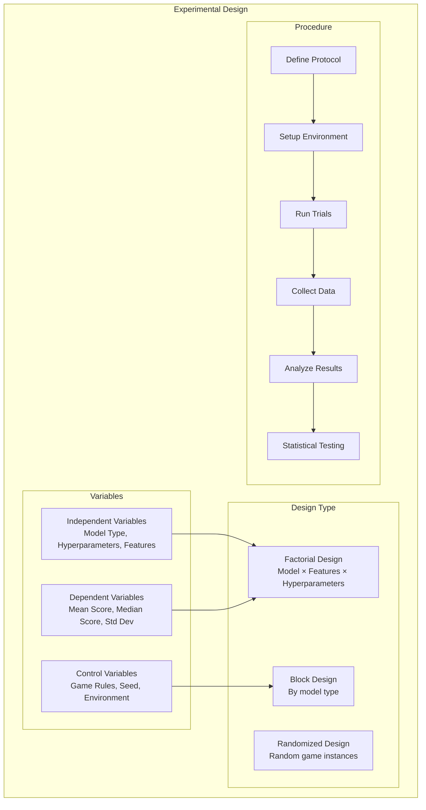
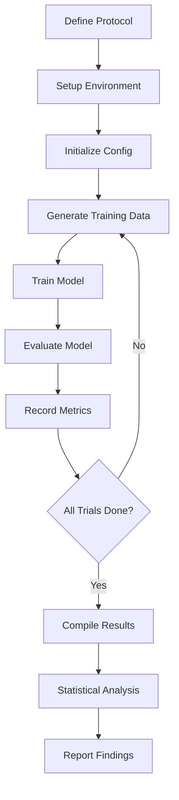
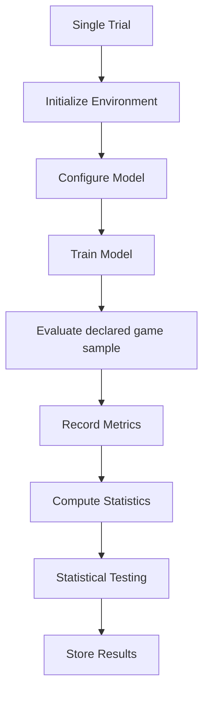
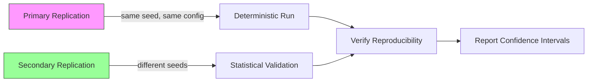

# Plan 01 — Experimental Design: the repository status is explicit and evidence based

> **Status: PARTIAL (2026-09-27).** Two-track design remains proposed. A three-dataset diagnostic was run; matched baselines, resource profiling, power rationale, and plan-scale policy experiments remain pending.

**Goal:** State the current implementation and evidence boundary for experimental design.
**Builds on:** [00](../../00-scope-and-traceability.md) — the project is supervised 4×4 2048 policy learning, and framework evaluation is a separate research track.

---

## Decision and evidence

**This is a proposed design, not a preregistered confirmatory experiment.** A seed-42 UCI diagnostic matrix (three datasets, five model variants) exists under `reports/framework_validation/`; under AutoML `82d8483`, the two runs matched all 15 predictions and save/load equivalence. The earlier `88a86bf` discrepancy is retained as historical evidence. Baselines, resource profiling, plan-scale training/evaluation, sample-size rationale, and analysis assumptions remain open.

## 1. Purpose

Define the experimental design for the 2048 ML research study. This section provides the rigorous experimental framework expected at the PhD level, including formal variable definitions, trial structure, replication strategy, and bias controls.

The design has two tracks: **framework validation** on standard tabular tasks, followed by **2048 application evaluation**. The framework track is a prerequisite and is specified in `07-Benchmarking/03-Comparison/04-framework-validation.md`. The 2048 track must not be used to conceal framework failures or missing capabilities.

The framework track is the primary experiment. Its units are dataset–configuration–seed runs, and its outcomes include predictive quality, runtime, memory, search efficiency, failure rate, and artifact reproducibility. The 2048 track is a downstream case study whose units include trained-model runs, evaluation seeds, and game instances.

## 2. Experimental Design Overview

## 3. Experimental Variables

| Variable | Type | Values | Notes |
|----------|------|--------|-------|
| Framework Model Architecture | Independent | Declared supported model types | Confirm current capabilities before selecting candidates |
| Framework Configuration | Independent | Defaults or declared search configuration | Match budgets and record failures |
| Application Model Architecture | Independent | Implemented four-class integration candidates | Integration whitelist is narrower than framework enum |
| Feature Set | Independent | Canonical 17-value state: 16 cells plus current score | Fixed across the initial policy models; any ablation must declare its removed feature groups |
| Training Algorithm | Independent | Declared training configuration | Tuning comparison not yet run |
| Hyperparameters | Independent | Search space defined in HyperOptX | TPE sampler |
| Framework Quality | Dependent | Dataset-appropriate predictive metric | Primary framework metric |
| Framework Resources | Dependent | Time, memory, failures, search efficiency | Systems evaluation |
| Score | Dependent | Continuous | Primary 2048 case-study metric |
| Median Score | Dependent | Continuous | Robustness check |
| Training Time | Dependent | Continuous | Efficiency metric |
| Training dynamics | Dependent | Only if exposed by selected trainer | Not currently a game-score result |
| Game Rules | Control | Fixed | Standard 4×4 2048 |
| Random Seed | Control | Declare training and evaluation seeds separately | One seed does not establish robustness |
| Game Environment | Control | Fixed | Custom Rust 2048 |
| Evaluation Games | Control | To be justified and declared | No automatic power guarantee |

## 4. Experimental Procedure

The framework-validation gate is partial. A repeated standard-dataset diagnostic exists, but matched external baselines, resource measurements, and broader-seed reproducibility are still required before claims that depend on those capabilities. Small capability smokes may continue as engineering checks, clearly separated from confirmatory policy experiments.

## 5. Trial Structure

## 6. Replication Strategy

**Repeatability check:** Repeat an identical configuration and seed; one repeat pair is only a smoke check, not general reproducibility evidence.

**Robustness study:** Select training and evaluation seed sets separately and justify their counts before collection. The earlier five-seed list is a proposal, not a completed design.

**Evaluation instances:** Record per-game outcomes and account for shared trained-model and seed effects; game IDs alone do not establish independent experimental units.

## 7. Bias Controls

- **Fixed game rules** across all experiments (standard 4×4 board, 0.9/0.1 spawn)
- **Consistent data pipeline** for all models (same canonical 17-value state, rollout labels 100 sims/action, and game-group boundaries for GroupKFold where applicable)
- **Same evaluation criteria** for all models (same declared instances where pairing is intended; measure baselines under the same protocol)
- **Same seed** for reproducibility (primary `42`; secondary `123,456,789,1011`)
- **No blinded analysis** — game scores are objective numeric; blinding adds no value and is removed
- **Comparison assumptions**: shared sequences induce pairing; select a paired/clustered method rather than treating them as independent observations

## 8. Equipment and Tools (Record Actual Study Versions)

| Tool | Version | Purpose | Notes |
|------|---------|---------|-------|
| automl | Submodule pin plus worktree state | ML training | Record exact commit and local modifications |
| Rust | Manifest minimum `1.75` | Game engine + automl | Record actual compiler and target |
| polars | `0.46` dependency | Data processing | Root data workflow uses CSV; do not imply Parquet collection |
| HyperOptX | Current local integration | Hyperparameter search | Root supports a schema-versioned search config; pruning remains unavailable |
| Seeds | Per declared protocol | Reproducibility | Separate data, training, and evaluation seed roles |

## 9. Ethical Considerations

All experiments use simulation only. No human subjects are involved. All data is generated from game simulations. No personal data is collected or processed.

## 10. Methodology Limitations

- **Limited to 2048 game domain** — results may not generalize to other games
- **automl framework constraints** — limited to supervised classification models
- **Computational resource limitations** — training time may restrict experiments
- **Supervised learning only** — no reward shaping or policy gradient methods
- **Single-seed primary experiments** — multi-seed validation planned but may be resource-intensive
- **Feature engineering fixed** — the canonical state is 17 values; no additional history features are included

## 11. Sample Size Justification

**2048 application analysis:** Any proposed game count is a planning target, not an automatic power guarantee. Final sample-size justification must use the declared experimental unit, a minimum practically meaningful score difference, estimated variance, paired/clustered structure, and the number of trained-model repetitions.

**Learning curves:** Not currently generated as an epoch-level outcome. If added, justify evaluation precision empirically; no fixed 100-game sufficiency claim is established.

**Framework validation:** Dataset-level repetitions and resource measurements are planned separately from 2048 game counts.

**Ablation study:** Use the same evaluation protocol as the selected 2048 case-study comparison, with uncertainty estimates and an explicit practical-effect threshold. Do not infer validity from game count alone.

## 12. Data Quality Controls

Validation checklist — mark complete only after evidence is produced:
- [x] Same-seed repeatability smoke under AutoML `82d8483` (15/15 prediction and save/load matches); broader seed/configuration reproducibility remains open
- [ ] Statistical validity and test assumptions
- [ ] Absence of systematic bias in framework and application comparisons
- [ ] Proper data collection procedures
- [ ] Correct feature extraction (canonical 17-value state)
- [ ] Valid label generation (rollout-based, 100 sims/action)

## 13. Pre-registration

This design has not been externally or timestampedly preregistered. Before confirmatory collection, record:
- All hypotheses stated before data collection
- All evaluation criteria defined before analysis
- All statistical tests specified before results
- Any deviations will be documented and justified

## Implementation Record

- The two-track design is proposed, not pre-registered. The standard-dataset diagnostic used a fixed seed-42 split and is retained; under AutoML `82d8483`, two runs matched all 15 prediction sets and save/load outputs. This one-split repeatability smoke is not a matched-baseline or resource study. Policy scale and sample size are undecided. Collector labels are generated before grouped CV, and grouped CV is not chronological. Resolve leakage boundaries, trained-model versus game-level experimental units, pairing, budget, and test choice before confirmatory evaluation.

---

## Verification (definition of done)

1. `test -f plans/08-Research-Report/02-Methodology/01-experimental-design.md` exits 0.
2. `grep -q '^# Plan 01 — ' plans/08-Research-Report/02-Methodology/01-experimental-design.md` exits 0.
3. `grep -q '^> \\*\\*Status:' plans/08-Research-Report/02-Methodology/01-experimental-design.md` exits 0.
4. `grep -q '^\*\*Goal:' plans/08-Research-Report/02-Methodology/01-experimental-design.md` exits 0.
5. `grep -q '^## Decision and evidence$' plans/08-Research-Report/02-Methodology/01-experimental-design.md` exits 0.
6. `grep -q '^## Open questions$' plans/08-Research-Report/02-Methodology/01-experimental-design.md` exits 0.
7. `grep -q '^## Later$' plans/08-Research-Report/02-Methodology/01-experimental-design.md` exits 0.
8. `bash /Users/evintleovonzko/Documents/works/kolosal/planout2/v2-ai-express/.claude/skills/writing-planout-plans/check-plan.sh plans/08-Research-Report/02-Methodology/01-experimental-design.md` exits 0.

## Open questions

- **Protocol decisions remain open.** Predeclare datasets, splits, budgets, experimental units, seed roles, practical thresholds, and analysis before confirmatory runs. Large collection requires an explicit compute budget and retained artifacts.

## Later

- **Complete the remaining research or implementation work recorded above.** It stays deferred until its prerequisites, compute budget, and measurable acceptance evidence are available.
