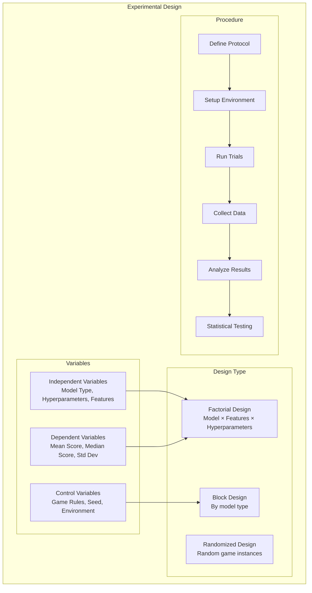
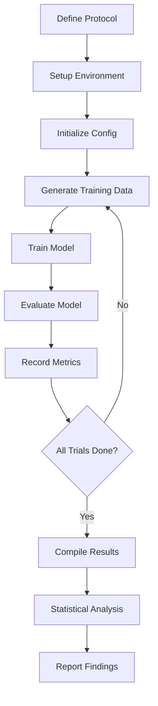
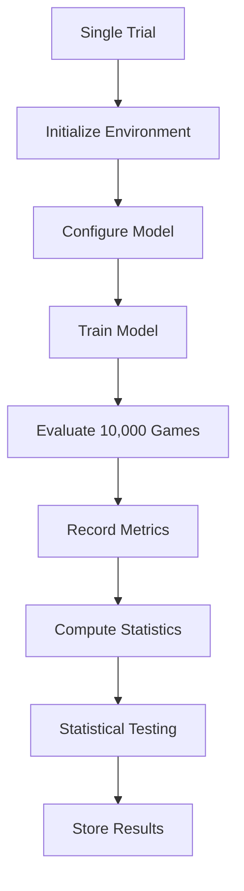

# Plan 01 — Experimental Design: the repository status is explicit and evidence based

> **Status: PLANNED.** Not yet restarted in strict sequence.

**Goal:** State the current implementation and evidence boundary for experimental design.
**Builds on:** [00](../../00-scope-and-traceability.md) — the project is supervised 4×4 2048 policy learning, and framework evaluation is a separate research track.

---

## Decision and evidence

**This plan treats its subject as partial or pending work, not as a research finding.** The rejected alternative is to infer completion from a plan title or related code alone. The ledger records this disposition: Not yet restarted in strict sequence.

## 1. Purpose

Define the experimental design for the 2048 ML research study. This section provides the rigorous experimental framework expected at the PhD level, including formal variable definitions, trial structure, replication strategy, and bias controls.

The design has two tracks: **framework validation** on standard tabular tasks, followed by **2048 application evaluation**. The framework track is a prerequisite and is specified in `07-Benchmarking/03-Comparison/04-framework-validation.md`. The 2048 track must not be used to conceal framework failures or missing capabilities.

The framework track is the primary experiment. Its units are dataset–configuration–seed runs, and its outcomes include predictive quality, runtime, memory, search efficiency, failure rate, and artifact reproducibility. The 2048 track is a downstream case study whose units include trained-model runs, evaluation seeds, and game instances.

## 2. Experimental Design Overview

## 3. Experimental Variables

| Variable | Type | Values | Notes |
|----------|------|--------|-------|
| Framework Model Architecture | Independent | RandomForest, GradientBoosting, XGBoost, LightGBM, ExtraTrees, SVM, KNN | Candidate models exposed by AutoML |
| Framework Configuration | Independent | Defaults, fixed search, TPE/other declared search | Matched search budget |
| Application Model Architecture | Independent | AutoML-supported model types | 2048 case study |
| Feature Set | Independent | 27-dimensional feature vector | Fixed across all models |
| Training Algorithm | Independent | automl default, HyperOptX-tuned | Two configurations |
| Hyperparameters | Independent | Search space defined in HyperOptX | TPE sampler |
| Framework Quality | Dependent | Dataset-appropriate predictive metric | Primary framework metric |
| Framework Resources | Dependent | Time, memory, failures, search efficiency | Systems evaluation |
| Score | Dependent | Continuous | Primary 2048 case-study metric |
| Median Score | Dependent | Continuous | Robustness check |
| Training Time | Dependent | Continuous | Efficiency metric |
| Convergence Epoch | Dependent | Discrete | Training dynamics |
| Game Rules | Control | Fixed | Standard 4×4 2048 |
| Random Seed | Control | Fixed (42) | Reproducibility |
| Game Environment | Control | Fixed | Custom Rust 2048 |
| Evaluation Games | Control | Fixed (10,000) | Consistent sample size |

## 4. Experimental Procedure

Before generating 2048 training data, complete the AutoML capability gate: verify the required APIs, model types, preprocessing, validation, optimization, serialization, and deterministic behavior. Record failures as framework findings and revise the affected 2048 claim before continuing.

## 5. Trial Structure

## 6. Replication Strategy

**Primary replication:** Same seed (42), same configuration, run once to verify deterministic reproducibility.

**Secondary replication:** Different seeds (42, 123, 456, 789, 1011) to assess robustness and generalizability.

**Tertiary replication:** Different random game instances to assess generalization to unseen board states.

## 7. Bias Controls

- **Fixed game rules** across all experiments (standard 4×4 board, 0.9/0.1 spawn)
- **Consistent data pipeline** for all models (same 27-dim extraction, rollout labels 100 sims/action, same `game_id` for GroupKFold)
- **Same evaluation criteria** for all models (identical 10,000 game sequences, seed 42, same heuristic ~512 / random ~128 reference)
- **Same seed** for reproducibility (primary `42`; secondary `123,456,789,1011`)
- **No blinded analysis** — game scores are objective numeric; blinding adds no value and is removed
- **Balanced evaluation** all models evaluated on identical game sequences (paired comparison valid for MWU)

## 8. Equipment and Tools (Pinned — No Drift)

| Tool | Version | Purpose | Notes |
|------|---------|---------|-------|
| automl | `v1.0.0` | ML training | `TrainEngine`, `TaskType::MultiClassification`, `ModelType` enum, `CrossValidator::GroupKFold` |
| Rust | `1.75` | Game engine + automl | Pinned `Cargo.lock`, no GPU |
| polars | `0.46` | Data processing | Parquet I/O, pinned `requirements.txt` |
| HyperOptX | `automl v1.0.0` bundled | Hyperparameter search | TPE + MedianPruner, verify in `automl/src/optimizer` |
| Seed | `42` | Reproducibility | Primary; secondary seeds recorded in sidecar |

## 9. Ethical Considerations

All experiments use simulation only. No human subjects are involved. All data is generated from game simulations. No personal data is collected or processed.

## 10. Methodology Limitations

- **Limited to 2048 game domain** — results may not generalize to other games
- **automl framework constraints** — limited to supervised classification models
- **Computational resource limitations** — training time may restrict experiments
- **Supervised learning only** — no reward shaping or policy gradient methods
- **Single-seed primary experiments** — multi-seed validation planned but may be resource-intensive
- **Feature engineering fixed** — the 27-dimensional feature vector is predetermined

## 11. Sample Size Justification

**2048 application analysis:** 10,000 games is an initial precision target, not an automatic power guarantee. Final sample-size justification must use the declared experimental unit, a minimum practically meaningful score difference, estimated variance, paired/clustered structure, and the number of trained-model repetitions.

**Convergence analysis:** 100 games per epoch
- Provides stable learning curve estimates
- Sufficient for convergence detection

**Framework validation:** Dataset-level repetitions and resource measurements are planned separately from 2048 game counts.

**Ablation study:** Use the same evaluation protocol as the selected 2048 case-study comparison, with uncertainty estimates and an explicit practical-effect threshold. Do not infer validity from game count alone.

## 12. Data Quality Controls

Validation checklist — mark complete only after evidence is produced:
- [ ] Framework reproducibility with declared seeds
- [ ] Statistical validity and test assumptions
- [ ] Absence of systematic bias in framework and application comparisons
- [ ] Proper data collection procedures
- [ ] Correct feature extraction (27-dimensional vector)
- [ ] Valid label generation (rollout-based, 100 sims/action)

## 13. Pre-registration

This experimental design is pre-registered to prevent p-hacking and HARKing (Hypothesizing After Results are Known):
- All hypotheses stated before data collection
- All evaluation criteria defined before analysis
- All statistical tests specified before results
- Any deviations will be documented and justified

## Implementation Record

- A two-track framework/case-study protocol and seed/group controls are specified. It is not executed or externally pre-registered. The current collector labels before splitting and current grouped CV is not chronological; the planned split/label ordering and inferential unit need resolution before running the full experiment.

---

## Verification (definition of done)

1. `test -f plans/08-Research-Report/02-Methodology/01-experimental-design.md` exits 0.
2. `grep -q '^# Plan 01 — ' plans/08-Research-Report/02-Methodology/01-experimental-design.md` exits 0.
3. `grep -q '^> \\*\\*Status:' plans/08-Research-Report/02-Methodology/01-experimental-design.md` exits 0.
4. `grep -q '^\*\*Goal:' plans/08-Research-Report/02-Methodology/01-experimental-design.md` exits 0.
5. `grep -q '^## Decision and evidence$' plans/08-Research-Report/02-Methodology/01-experimental-design.md` exits 0.
6. `grep -q '^## Open questions$' plans/08-Research-Report/02-Methodology/01-experimental-design.md` exits 0.
7. `grep -q '^## Later$' plans/08-Research-Report/02-Methodology/01-experimental-design.md` exits 0.
8. `bash /Users/evintleovonzko/Documents/works/kolosal/planout2/v2-ai-express/.claude/skills/writing-planout-plans/check-plan.sh plans/08-Research-Report/02-Methodology/01-experimental-design.md` exits 0.

## Open questions

- **The plan-scale evidence remains bounded by current results.** Not yet restarted in strict sequence. Any larger corpus or external benchmark needs a declared resource budget and retained artifacts.

## Later

- **Complete the remaining research or implementation work recorded above.** It stays deferred until its prerequisites, compute budget, and measurable acceptance evidence are available.
