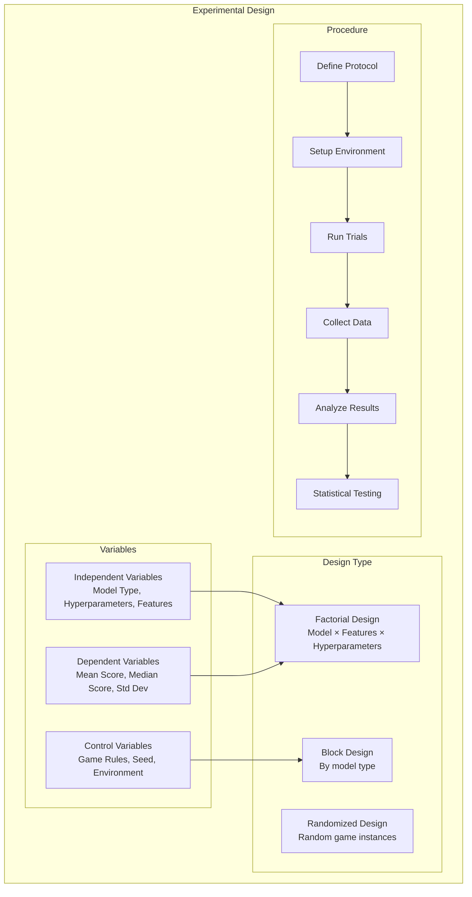
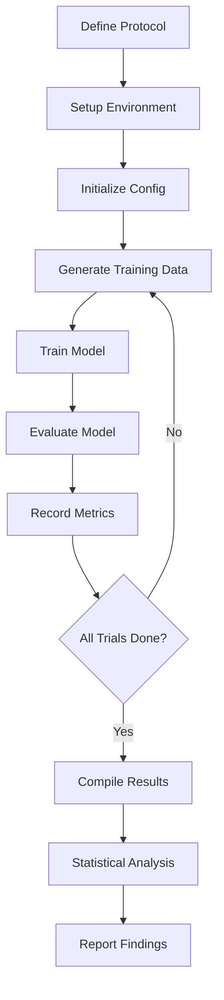
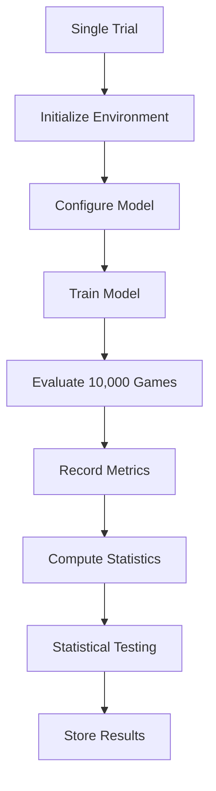

# Experimental Design

## 1. Purpose

Define the experimental design for the 2048 ML research study. This section provides the rigorous experimental framework expected at the PhD level, including formal variable definitions, trial structure, replication strategy, and bias controls.

## 2. Experimental Design Overview

## 3. Experimental Variables

| Variable | Type | Values | Notes |
|----------|------|--------|-------|
| Model Architecture | Independent | RandomForest, GradientBoosting, XGBoost, LightGBM, ExtraTrees, SVM, KNN | 7 candidate models |
| Feature Set | Independent | 27-dimensional feature vector | Fixed across all models |
| Training Algorithm | Independent | automl default, HyperOptX-tuned | Two configurations |
| Hyperparameters | Independent | Search space defined in HyperOptX | TPE sampler |
| Score | Dependent | Continuous | Primary metric |
| Median Score | Dependent | Continuous | Robustness check |
| Training Time | Dependent | Continuous | Efficiency metric |
| Convergence Epoch | Dependent | Discrete | Training dynamics |
| Game Rules | Control | Fixed | Standard 4×4 2048 |
| Random Seed | Control | Fixed (42) | Reproducibility |
| Game Environment | Control | Fixed | Custom Rust 2048 |
| Evaluation Games | Control | Fixed (10,000) | Consistent sample size |

## 4. Experimental Procedure

## 5. Trial Structure

## 6. Replication Strategy

**Primary replication:** Same seed (42), same configuration, run once to verify deterministic reproducibility.

**Secondary replication:** Different seeds (42, 123, 456, 789, 1011) to assess robustness and generalizability.

**Tertiary replication:** Different random game instances to assess generalization to unseen board states.

## 7. Bias Controls

- **Fixed game rules** across all experiments (standard 4×4 board)
- **Consistent data pipeline** for all models (same feature extraction, same label generation)
- **Same evaluation criteria** for all models (same 10,000 games, same seed)
- **Same seed** for reproducibility (primary seed = 42)
- **Blinded analysis** where applicable (results evaluated without knowledge of model identity)
- **Balanced evaluation** all models evaluated on identical game sequences

## 8. Equipment and Tools

| Tool | Version | Purpose | Notes |
|------|---------|---------|-------|
| automl | v1.0.0 | ML training | Evintkoo/automl |
| HyperOptX | latest | Hyperparameter search | Verify API in automl submodule |
| Rust | stable | Game engine | Custom 2048 implementation |
| polars | latest | Data processing | CSV/Parquet I/O |
| num_cpus | auto | Parallel training | Default: all available cores |

## 9. Ethical Considerations

All experiments use simulation only. No human subjects are involved. All data is generated from game simulations. No personal data is collected or processed.

## 10. Methodology Limitations

- **Limited to 2048 game domain** — results may not generalize to other games
- **automl framework constraints** — limited to supervised classification models
- **Computational resource limitations** — training time may restrict experiments
- **Supervised learning only** — no reward shaping or policy gradient methods
- **Single-seed primary experiments** — multi-seed validation planned but may be resource-intensive
- **Feature engineering fixed** — the 27-dimensional feature vector is predetermined

## 11. Sample Size Justification

**Primary analysis:** 10,000 games per model
- Provides 95% CI width of ~20 points (for σ=512)
- Power ≥ 0.99 for detecting effect size d=0.5
- Sufficient for Mann-Whitney U test with Bonferroni correction

**Convergence analysis:** 100 games per epoch
- Provides stable learning curve estimates
- Sufficient for convergence detection

**Ablation study:** 10,000 games per ablation configuration
- Consistent with primary analysis sample size
- Enables pairwise comparison with proper power

## 12. Data Quality Controls

All results verified for:
- Reproducibility with seed
- Statistical validity (proper test assumptions)
- Absence of systematic bias (balanced evaluation)
- Proper data collection procedures
- Correct feature extraction (27-dimensional vector)
- Valid label generation (rollout-based, 100 sims/action)

## 13. Pre-registration

This experimental design is pre-registered to prevent p-hacking and HARKing (Hypothesizing After Results are Known):
- All hypotheses stated before data collection
- All evaluation criteria defined before analysis
- All statistical tests specified before results
- Any deviations will be documented and justified
