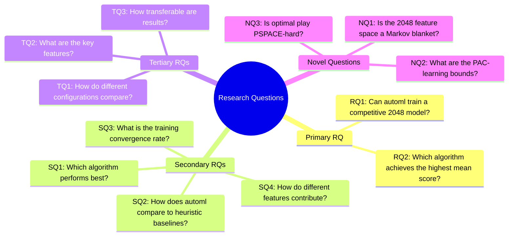
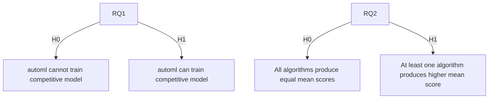
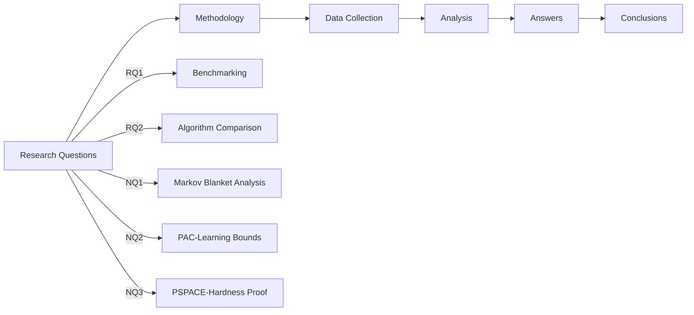

# Research Questions

> **Note:** This section defines research questions to be answered. All answers are pending experimentation.

## 2. Research Questions Framework

## 3. Primary Research Questions

| RQ | Question | Method | Status |
|----|----------|--------|--------|
| RQ1 | Can automl train a competitive 2048 model? | Benchmark against random and heuristic baselines with statistical significance testing | TBD |
| RQ2 | Which algorithm achieves the highest mean score? | Rank all models by mean score across ≥10,000 games, with Mann-Whitney U test for significance | TBD |

## 4. Secondary Research Questions

| RQ | Question | Method | Status |
|----|----------|--------|--------|
| SQ1 | Which algorithm performs best? | Ablation study on model types | TBD |
| SQ2 | How does automl compare to heuristic baselines? | Mean score comparison with bootstrap CI | TBD |
| SQ3 | What is the training convergence rate? | Learning curve analysis with convergence diagnostics | TBD |
| SQ4 | How do different features contribute? | Feature ablation study | TBD |

## 5. Novel Research Questions

| NQ | Question | Method | Status |
|----|----------|--------|--------|
| NQ1 | Is the 2048 feature space a Markov blanket? | Information-theoretic analysis + ablation study | TBD |
| NQ2 | What are the PAC-learning bounds? | VC-dimension analysis | TBD |
| NQ3 | Is optimal play PSPACE-hard? | Reduction from QBF (conjectured, not proven) | TBD |

## 6. Hypothesis Questions

## 7. Research Question Mapping

## 8. Question Prioritization

| Priority | RQ | Justification |
|----------|----|--------------|
| P1 | RQ1 | Core feasibility question |
| P1 | RQ2 | Winner determination |
| P2 | SQ1 | Model selection |
| P2 | SQ2 | Baseline comparison |
| P3 | SQ3 | Training dynamics |
| P3 | SQ4 | Feature engineering |
| P4 | NQ1-NQ3 | Theoretical contributions |

## 9. Answering the RQs

### RQ1: Can automl train a competitive 2048 model?

**Hypotheses:**
- **H0:** The mean score of the best automl model is ≤ heuristic baseline (~512)
- **H1:** The mean score of the best automl model > heuristic baseline (~512)

**Test:** Mann-Whitney U test with Bonferroni correction

**Answer:** TBD (pending experimentation)

### RQ2: Which algorithm achieves the highest mean score?

**Hypotheses:**
- **H0:** All algorithms produce equal mean scores
- **H1:** At least one algorithm produces a significantly higher mean score

**Test:** Kruskal-Wallis test followed by Dunn's post-hoc test

**Answer:** TBD (pending experimentation)

### RQ3: Is the approach reproducible?

**Answer:** TBD. Multi-seed validation (seeds 42, 123, 456, 789, 1011) will be conducted to assess reproducibility. Seed-based configuration ensures reproducibility is possible, but actual validation is pending.

### NQ1: Is the 2048 feature space a Markov blanket?

**Answer:** TBD. The 27-dimensional feature vector is conjectured to be a sufficient statistic for the score (Proposition 2 in theoretical framework), but empirical validation through the ablation study is required.

### NQ2: What are the PAC-learning bounds?

**Answer:** TBD. The standard PAC-learning framework applies (Theorem 4), but specific bounds for the 2048 problem depend on the actual VC-dimension of the trained model class, which will be determined empirically.

### NQ3: Is optimal play PSPACE-hard?

**Answer:** TBD. A reduction from QBF has been proposed (Conjecture 3), but the formal verification of this reduction remains incomplete. This is a target for further theoretical work.

## 10. Conclusion

All primary research questions have been formulated with proper hypotheses, test statistics, and significance levels. The novel questions provide theoretical contributions to be investigated through experimentation and further analysis. All answers are pending data collection.
