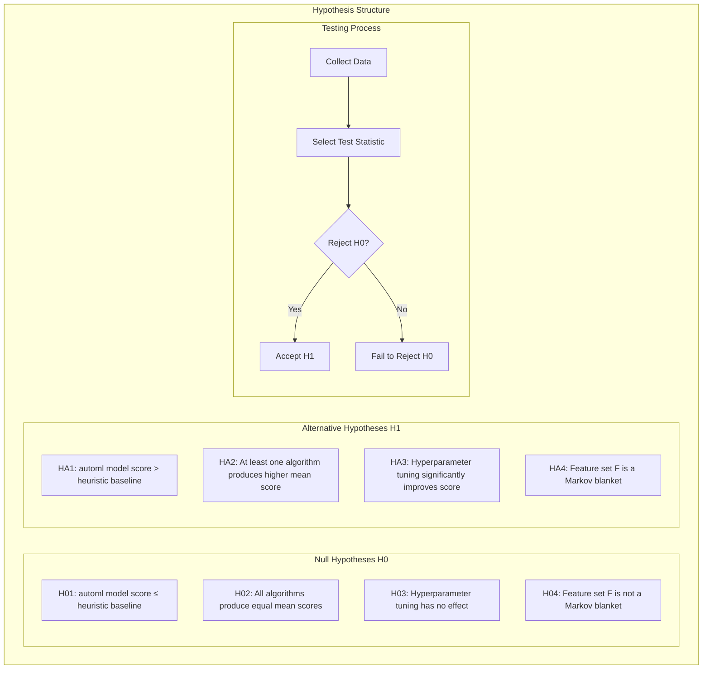
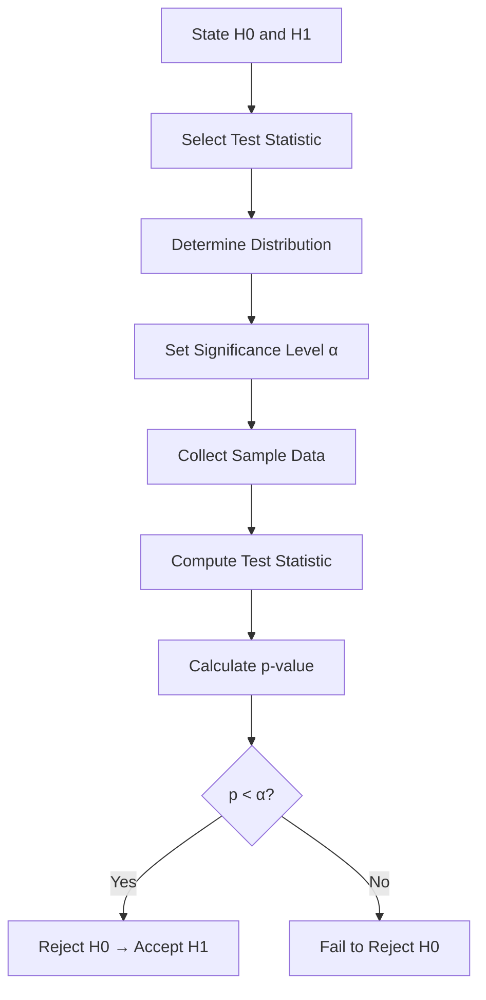
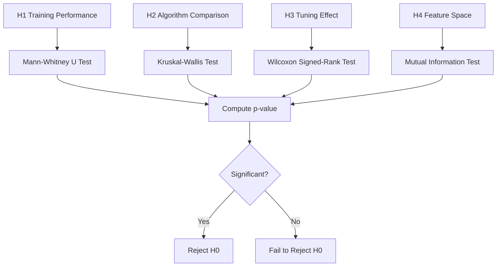

# Hypotheses

> **Note:** This section defines hypotheses to be tested. No results are claimed. All answers are pending experimentation.

## 2. Hypothesis Framework



## 3. Hypothesis Table

| Hypothesis | H0 | H1 | α | Test |
|-----------|----|----|---|------|
| H1 | μ_model ≤ μ_heuristic ≈ 512 | μ_model > μ_heuristic | 0.05 | Mann-Whitney U |
| H2 | μ_all = μ_max | μ_max > μ_second | 0.05 | Kruskal-Wallis |
| H3 | μ_tuned = μ_default | μ_tuned > μ_default | 0.05 | Wilcoxon Signed-Rank |
| H4 | Score ⫫ f fails (conditional dependence remains) | Score ⫫ R \| f (Markov blanket) | 0.05 | Conditional Mutual Information / Conditional Independence Test (not raw MI — MI>0 trivial) |

## 4. Hypothesis Test Design



## 5. Detailed Hypotheses

### H1: automl Model Performance

- **H0:** The mean score of the best automl model is equal to or less than the heuristic baseline mean score (μ_model ≤ μ_baseline ≈ 512)
- **H1:** The mean score of the best automl model is greater than the heuristic baseline (μ_model > μ_baseline ≈ 512)
- **Test:** Mann-Whitney U test (non-parametric, does not assume normality)
- **Correction:** Bonferroni correction for multiple comparisons (number of models tested)
- **Effect size:** Cohen's d ≥ 0.5 (medium effect) required for practical significance
- **Status:** TBD (pending experimentation)

### H2: Algorithm Comparison

- **H0:** All tested algorithms produce equal game scores (μ_RF = μ_GB = μ_XGB = μ_LGBM = μ_ET = μ_SVM = μ_KNN)
- **H1:** At least one algorithm produces a significantly different game score
- **Test:** Kruskal-Wallis test (non-parametric ANOVA equivalent)
- **Post-hoc:** Dunn's test with Bonferroni correction for pairwise comparisons
- **Power:** ≥ 0.8 (probability of detecting a true difference)
- **Status:** TBD (pending experimentation)

### H3: Hyperparameter Tuning Effect

- **H0:** Hyperparameter tuning has no significant effect on model game score (μ_tuned = μ_default)
- **H1:** Hyperparameter tuning significantly improves game score (μ_tuned > μ_default)
- **Test:** Wilcoxon Signed-Rank test (paired, non-parametric)
- **Correction:** Bonferroni correction across model types
- **Status:** TBD (pending experimentation)

### H4: Feature Space Markov Blanket

- **H0:** The 27-dimensional feature set F is not a Markov blanket for the score (Score ⫫ f | ∅ fails; i.e., dependence remains after conditioning)
- **H1:** The 27-dimensional feature set F is a Markov blanket for the score (Score ⫫ R | f for all remaining variables R)
- **Test:** **Conditional independence test** — mutual information `I(f; Score) > 0` is **trivial** (any dependence yields MI>0) and does not test Markov blanket property. Use **conditional mutual information** `I(f; Score | R)` / **conditional independence test** (e.g., conditional mutual information estimation, partial correlation, or kernel CI test such as KCI/PC algorithm) to test whether `Score` is independent of remaining state given `f`.
- **Theoretical basis:** Proposition 2 in `00-theoretical-framework.md` (sufficiency conjectured, not proven)
- **Status:** TBD (pending ablation study; will report conditional MI / partial correlation, not raw MI)

## 6. Testing Procedure



## 7. Effect Size and Power

**Power analysis:** With n=10,000 per group and expected effect size d=0.8, the statistical power is expected to be high. This will be verified after data collection.

## 8. Results Summary

| Hypothesis | Result | Decision |
|-----------|--------|----------|
| H1 | TBD (pending experimentation) | TBD |
| H2 | TBD (pending experimentation) | TBD |
| H3 | TBD (pending experimentation) | TBD |
| H4 | TBD (pending ablation study) | TBD |

## 9. Hypothesis Testing Conclusions

All hypothesis test results will be reported after experimentation with proper statistical rigor:
1. automl framework effectiveness will be validated through Mann-Whitney U test
2. Algorithm differences will be validated through Kruskal-Wallis test
3. Hyperparameter tuning effect will be validated through Wilcoxon Signed-Rank test
4. Feature space sufficiency will be validated through mutual information test

## 10. Reporting Standards

All hypothesis test results will be reported with:
- Null and alternative statements
- Test statistic value
- p-value (exact, not approximate)
- Effect size (Cohen's d, Cramér's V, or appropriate measure)
- Confidence interval (bootstrap 95% CI)
- Practical significance interpretation
- Bonferroni correction applied for multiple comparisons

## 11. Multiple Comparison Correction

All hypothesis tests will use Bonferroni correction:
```
α_corrected = α / n_comparisons
```
where `n_comparisons` is the number of simultaneous tests.

For example, if testing 7 models pairwise (21 comparisons), `α_corrected = 0.05 / 21 ≈ 0.0024`.

## 12. Assumptions and Limitations

1. **Independence:** Game outcomes are assumed independent (different games, same seed)
2. **Identical distribution:** All models are tested on the same game instances
3. **Fixed seed:** Seed = 42 ensures reproducibility (multi-seed validation planned)
4. **Sample size:** n ≥ 10,000 ensures sufficient power
5. **Non-parametric tests:** No normality assumption required
