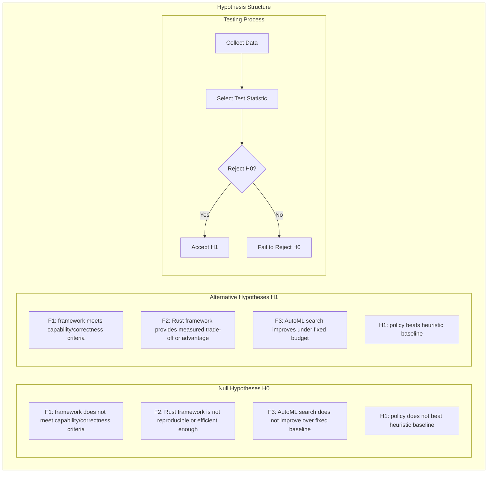
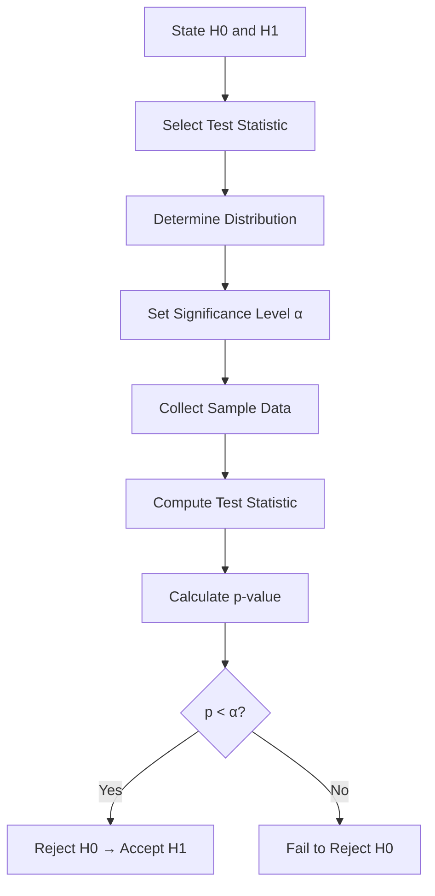
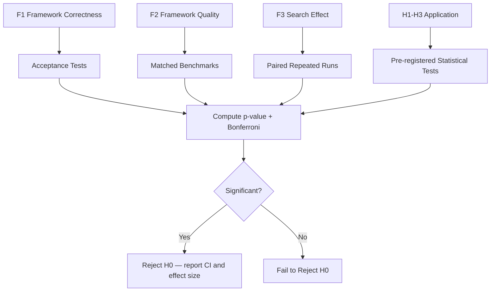

# Plan 03 — Hypotheses: the repository status is explicit and evidence based

> **Status: PARTIAL (2026-09-26).** Hypotheses are provisional and untested; statistical tests, effect thresholds, and study power require a finalized protocol.

**Goal:** State the current implementation and evidence boundary for hypotheses.
**Builds on:** [00](../../00-scope-and-traceability.md) — the project is supervised 4×4 2048 policy learning, and framework evaluation is a separate research track.

---

## Decision and evidence

**This plan records questions for future testing, not evidence.** The study protocol is not finalized; planned sample sizes do not establish power, and several named tests are not implemented.

> **Note:** This section defines hypotheses to be tested. No results are claimed. All answers are pending experimentation.

The primary hypotheses concern the Rust-native AutoML framework. The 2048 hypotheses are application-case-study hypotheses. Architecture questions that cannot be reduced to a valid statistical test are evaluated through design evidence, correctness tests, benchmark comparisons, and documented trade-offs.

## 1. Hypothesis Framework

## 2. Hypothesis Table

| Hypothesis | H0 | H1 | α | Test |
|-----------|----|----|---|------|
| F1 | Required framework capability or correctness criterion fails | All predeclared capability and correctness criteria pass | — | Acceptance tests and oracle comparisons |
| F2 | Rust-native implementation does not meet the predeclared quality/efficiency target | It meets the target or demonstrates a documented trade-off | 0.05 where applicable | Matched benchmark and resource analysis |
| F3 | AutoML search does not improve over fixed configuration at matched budget | Search improves the primary validation metric or resource efficiency | 0.05 | Paired repeated-run comparison |
| H1 | Policy outcome is no better than the measured baseline under the declared estimand | Improvement exceeds a predeclared practical threshold | To be set | Select test after unit/pairing design |
| H2 | Supported candidate outcomes do not differ materially | At least one pair differs by a predeclared practical amount | To be set | Pairwise helpers only; no global test |
| H3 | Tuning does not improve the declared quality/resource objective | Tuning improves it under matched budgets | To be set | Matched repeated-run design pending |

## 3. Hypothesis Test Design

## 4. Detailed Hypotheses

### H1: Policy Comparison

- Define the estimand and practical improvement threshold after measuring a reproducible baseline.
- Choose paired or independent inference based on the evaluation design. Available helpers include Mann–Whitney U for unmatched samples and an exact sign test for matching seed sequences; dependence between games still needs consideration.
- Declare the multiplicity family before confirmatory analysis.
- **Effect size:** Cohen's d is reported to quantify practical magnitude; no universal 0.5 cutoff is used as an automatic exclusion rule.
- **Status:** Not tested; baseline and protocol pending

### H2: Algorithm Comparison

- Candidates must be limited to the actual integration-supported models.
- The comparison CLI can emit pairwise results and Holm-adjusted p-values; no global multi-group or post-hoc Dunn test is implemented.
- No sample-size/power analysis or outcome comparison has been completed.
- **Status:** Not tested; candidate matrix and protocol pending

### H3: Hyperparameter Tuning Effect

- **H0:** Hyperparameter tuning has no significant effect on model game score (μ_tuned = μ_default)
- **H1:** Hyperparameter tuning significantly improves game score (μ_tuned > μ_default)
- Wilcoxon signed-rank is not implemented. Select a paired method only after defining the independent replication unit and matched configuration design.
- **Status:** Not tested; matched tuning study pending

### Exploratory Feature Analysis

Feature groups are evaluated through predeclared ablations, held-out performance, uncertainty intervals, and sensitivity analysis. This analysis does not claim that the 27-dimensional feature set is a Markov blanket or sufficient statistic.

## 5. Testing Procedure

## 6. Effect Size and Power

**Power analysis:** None has been performed. Define a meaningful effect, variance, experimental unit, dependence structure, and multiplicity family before selecting a sample size. Game count alone does not determine power.

## 7. Results Summary

| Hypothesis | Result | Decision |
|-----------|--------|----------|
| F1 | TBD (pending framework validation) | TBD |
| F2 | TBD (pending framework validation) | TBD |
| F3 | TBD (pending framework validation) | TBD |
| H1 | TBD (pending application evaluation) | TBD |
| H2 | TBD (pending application evaluation) | TBD |
| H3 | TBD (pending application evaluation) | TBD |

## 8. Hypothesis Testing Conclusions

All hypothesis and framework-validation results will be reported after experimentation with proper statistical rigor:
1. Framework capabilities will be reported through acceptance tests, matched benchmarks, resource measurements, and reproducibility results.
2. Model comparisons will use supported pairwise helpers unless a validated global method is implemented.
3. Tuning and feature claims require matched studies and recorded budgets.
4. Feature analysis does not establish a Markov blanket or sufficiency claim.

## 9. Reporting Standards

All hypothesis test results will be reported with:
- Null and alternative statements
- Test statistic value
- p-value (exact, not approximate)
- Effect size (Cohen's d, Cramér's V, or appropriate measure)
- Confidence interval (bootstrap 95% CI)
- Practical significance interpretation
- Bonferroni correction applied for multiple comparisons

## 10. Multiple Comparison Correction

Declare the comparison family and correction before analysis. The CLI currently applies Holm adjustment to its pairwise p-values. A fixed Bonferroni family of 21 comparisons assumes seven candidates and is not applicable until the actual candidate set and confirmatory comparisons are specified.

## 11. Assumptions and Limitations

1. **Repeated conditions:** Game outcomes are analyzed with respect to shared seeds, paired instances, and trained-model repetitions; independence is not assumed automatically.
2. **Identical distribution:** All models are tested on the same declared game-instance protocol.
3. **Fixed seed:** Seed = 42 is a reproducibility condition, not evidence of generalization.
4. **Sample size:** Sample size is justified using a predeclared minimum practical effect and the experimental unit, not only the number of games.
5. **Test assumptions:** Non-parametric does not mean assumption-free; tie handling, exchangeability, dependence, and sampling design must be addressed.

## Implementation Record

- Framework and application hypotheses remain provisional and untested. Standard-dataset validation, model comparison, tuning, and ablation have not been run; no power analysis or confirmatory test family is established.

---

## Verification (definition of done)

1. `test -f plans/08-Research-Report/02-Methodology/03-hypotheses.md` exits 0.
2. `grep -q '^# Plan 03 — ' plans/08-Research-Report/02-Methodology/03-hypotheses.md` exits 0.
3. `grep -q '^> \\*\\*Status:' plans/08-Research-Report/02-Methodology/03-hypotheses.md` exits 0.
4. `grep -q '^\*\*Goal:' plans/08-Research-Report/02-Methodology/03-hypotheses.md` exits 0.
5. `grep -q '^## Decision and evidence$' plans/08-Research-Report/02-Methodology/03-hypotheses.md` exits 0.
6. `grep -q '^## Open questions$' plans/08-Research-Report/02-Methodology/03-hypotheses.md` exits 0.
7. `grep -q '^## Later$' plans/08-Research-Report/02-Methodology/03-hypotheses.md` exits 0.
8. `bash /Users/evintleovonzko/Documents/works/kolosal/planout2/v2-ai-express/.claude/skills/writing-planout-plans/check-plan.sh plans/08-Research-Report/02-Methodology/03-hypotheses.md` exits 0.

## Open questions

- **Hypotheses remain untested.** Finalize estimands, thresholds, experimental units, candidate set, multiplicity family, and resource budget before confirmatory data collection.

## Later

- **Complete the remaining research or implementation work recorded above.** It stays deferred until its prerequisites, compute budget, and measurable acceptance evidence are available.
