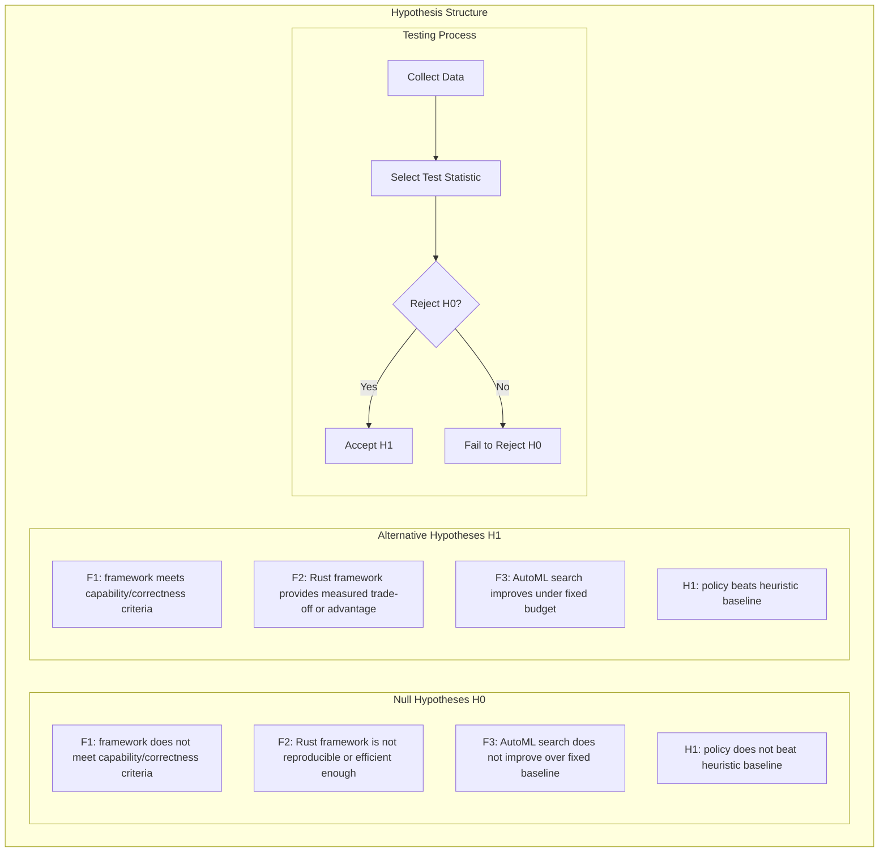
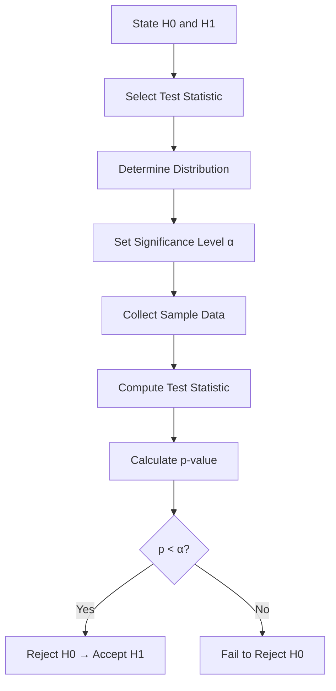
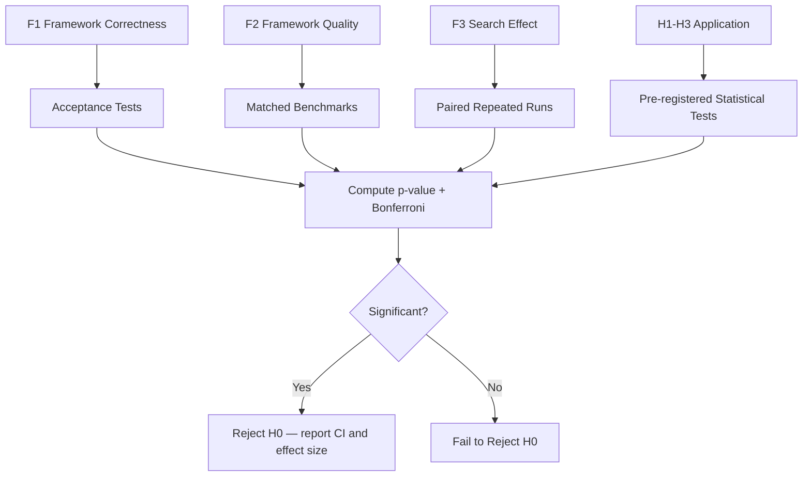

# Hypotheses

> **Note:** This section defines hypotheses to be tested. No results are claimed. All answers are pending experimentation.

The primary hypotheses concern the Rust-native AutoML framework. The 2048 hypotheses are application-case-study hypotheses. Architecture questions that cannot be reduced to a valid statistical test are evaluated through design evidence, correctness tests, benchmark comparisons, and documented trade-offs.

## 2. Hypothesis Framework



## 3. Hypothesis Table

| Hypothesis | H0 | H1 | α | Test |
|-----------|----|----|---|------|
| F1 | Required framework capability or correctness criterion fails | All predeclared capability and correctness criteria pass | — | Acceptance tests and oracle comparisons |
| F2 | Rust-native implementation does not meet the predeclared quality/efficiency target | It meets the target or demonstrates a documented trade-off | 0.05 where applicable | Matched benchmark and resource analysis |
| F3 | AutoML search does not improve over fixed configuration at matched budget | Search improves the primary validation metric or resource efficiency | 0.05 | Paired repeated-run comparison |
| H1 | μ_model ≤ μ_heuristic ≈ 512 | μ_model > μ_heuristic | 0.05 | Mann-Whitney U |
| H2 | μ_all = μ_max | μ_max > μ_second | 0.05 | Kruskal-Wallis |
| H3 | μ_tuned = μ_default | μ_tuned > μ_default | 0.05 | Wilcoxon Signed-Rank |

## 4. Hypothesis Test Design



## 5. Detailed Hypotheses

### H1: automl Model Performance

- **H0:** The mean score of the best automl model is equal to or less than the heuristic baseline mean score (μ_model ≤ μ_baseline ≈ 512)
- **H1:** The mean score of the best automl model is greater than the heuristic baseline (μ_model > μ_baseline ≈ 512)
- **Test:** Mann-Whitney U test (non-parametric, does not assume normality)
- **Correction:** Bonferroni correction for multiple comparisons (number of models tested)
- **Effect size:** Cohen's d is reported to quantify practical magnitude; no universal 0.5 cutoff is used as an automatic exclusion rule.
- **Status:** TBD (pending experimentation)

### H2: Algorithm Comparison

- **H0:** All tested algorithms produce equal game scores (μ_RF = μ_GB = μ_XGB = μ_LGBM = μ_ET = μ_SVM = μ_KNN)
- **H1:** At least one algorithm produces a significantly different game score
- **Test:** Kruskal-Wallis test (non-parametric ANOVA equivalent)
- **Post-hoc:** Dunn's test with Bonferroni correction for pairwise comparisons
- **Power:** ≥ 0.8 (probability of detecting a true difference)
- **Status:** TBD (pending experimentation)

### H3: Hyperparameter Tuning Effect

- **H0:** Hyperparameter tuning has no significant effect on model game score (μ_tuned = μ_default)
- **H1:** Hyperparameter tuning significantly improves game score (μ_tuned > μ_default)
- **Test:** Wilcoxon Signed-Rank test (paired, non-parametric)
- **Correction:** Bonferroni correction across model types
- **Status:** TBD (pending experimentation)

### Exploratory Feature Analysis

Feature groups are evaluated through predeclared ablations, held-out performance, uncertainty intervals, and sensitivity analysis. This analysis does not claim that the 27-dimensional feature set is a Markov blanket or sufficient statistic.

## 6. Testing Procedure



## 7. Effect Size and Power

**Power analysis:** With n=10,000 per group and expected effect size d=0.8, the statistical power is expected to be high. This will be verified after data collection.

## 8. Results Summary

| Hypothesis | Result | Decision |
|-----------|--------|----------|
| F1 | TBD (pending framework validation) | TBD |
| F2 | TBD (pending framework validation) | TBD |
| F3 | TBD (pending framework validation) | TBD |
| H1 | TBD (pending application evaluation) | TBD |
| H2 | TBD (pending application evaluation) | TBD |
| H3 | TBD (pending application evaluation) | TBD |

## 9. Hypothesis Testing Conclusions

All hypothesis and framework-validation results will be reported after experimentation with proper statistical rigor:
1. framework capabilities will be reported through acceptance tests, matched benchmarks, resource measurements, and reproducibility results
2. Algorithm differences will be validated through Kruskal-Wallis test + Dunn post-hoc
3. Hyperparameter tuning effect will be validated through Wilcoxon Signed-Rank test
4. Feature groups will be evaluated through ablation and sensitivity analysis; no Markov-blanket claim is made by default

## 10. Reporting Standards

All hypothesis test results will be reported with:
- Null and alternative statements
- Test statistic value
- p-value (exact, not approximate)
- Effect size (Cohen's d, Cramér's V, or appropriate measure)
- Confidence interval (bootstrap 95% CI)
- Practical significance interpretation
- Bonferroni correction applied for multiple comparisons

## 11. Multiple Comparison Correction

All hypothesis tests will use Bonferroni correction:
```
α_corrected = α / n_comparisons
```
where `n_comparisons` is the number of simultaneous tests.

For example, if testing 7 models pairwise (21 comparisons), `α_corrected = 0.05 / 21 ≈ 0.0024`.

## 12. Assumptions and Limitations

1. **Repeated conditions:** Game outcomes are analyzed with respect to shared seeds, paired instances, and trained-model repetitions; independence is not assumed automatically.
2. **Identical distribution:** All models are tested on the same declared game-instance protocol.
3. **Fixed seed:** Seed = 42 is a reproducibility condition, not evidence of generalization.
4. **Sample size:** Sample size is justified using a predeclared minimum practical effect and the experimental unit, not only the number of games.
5. **Non-parametric tests:** No normality assumption required
