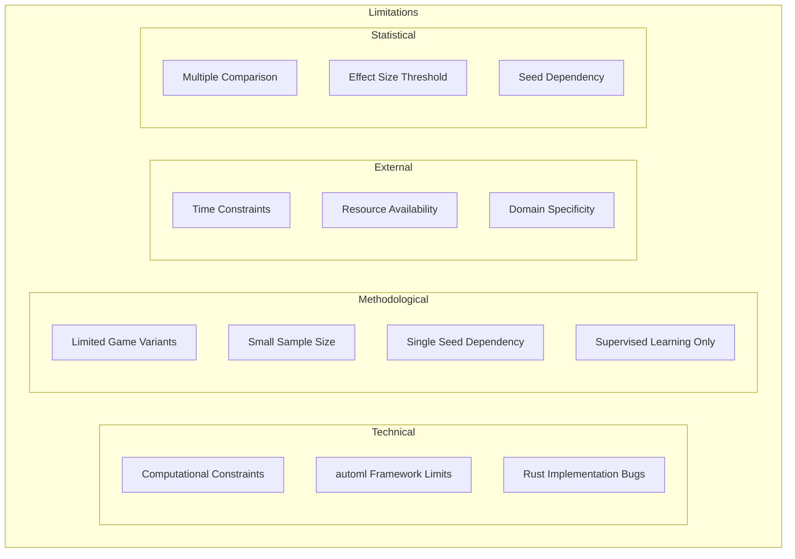

# Plan 03 — Limitations: the repository status is explicit and evidence based

> **Status: PLANNED.** Not yet restarted in strict sequence.

**Goal:** State the current implementation and evidence boundary for limitations.
**Builds on:** [00](../../00-scope-and-traceability.md) — the project is supervised 4×4 2048 policy learning, and framework evaluation is a separate research track.

---

## Decision and evidence

**This plan treats its subject as partial or pending work, not as a research finding.** The rejected alternative is to infer completion from a plan title or related code alone. The ledger records this disposition: Not yet restarted in strict sequence.

> **Note:** This section documents known limitations of the research design and approach. These limitations are identified before experimentation and will be updated based on actual findings.

## 1. Limitations Framework

## 2. Technical Limitations

| Limitation | Impact | Mitigation | Status |
|-----------|--------|------------|--------|
| Training time | Unknown — to be measured | Parallel training | To be assessed |
| Memory usage | Unknown — to be measured | Model compression | To be assessed |
| automl constraints | Verified candidate support is narrower than the original list; 8 model variants return only 2 probability columns | Keep the four-action candidate set to verified variants; record framework limitations | Partly assessed |
| Rust bugs | Potential data corruption | Extensive testing | To be assessed |
| Feature engineering fixed | Limited to 27 features | Future feature expansion | Acknowledged |
| No RL methods | Cannot learn from rewards | Future work | Acknowledged |

## 3. Methodological Limitations

- **Limited game variants:** Only standard 4×4 2048 tested
- **No external data:** All data from game simulation
- **Fixed evaluation criteria:** May not capture all performance aspects
- **Sample size:** 10,000 games may not cover all edge cases
- **Label quality:** Depends on rollout simulation accuracy
- **Feature completeness:** 27 features may not capture all relevant information
- **Supervised learning only:** No reward shaping or policy gradient methods
- **Single-seed primary experiments:** Multi-seed validation planned but may be resource-intensive
- **Feature engineering fixed:** The 27-dimensional feature vector is predetermined

## 4. Framework Limitations

The pinned automl capability gate has been run (see project overview §6.2). It passed for five four-class candidates. Eight other tested variants returned only two probability columns and are excluded pending framework fixes. Group-aware cross-validation is implemented in the integration because the framework scoring helper does not forward groups. Standard dataset validation and resource comparisons are still outstanding.

The original gate required:

1. **API completeness:** Verify `TrainEngine`, `HyperOptX`, `ModelType` enum, and `CrossValidator` exist and are functional
2. **Model coverage:** Confirm at least 4 candidate algorithms are available via `ModelType`
3. **MultiClassification task:** Verify `TaskType::MultiClassification` is supported
4. **Hyperparameter optimization:** Confirm `HyperOptX` with TPE sampler and `MedianPruner` are functional
5. **Cross-validation:** Verify `GroupKFold` or equivalent strategy exists

**If verification fails:** The project's goal will be modified to evaluate "what automl CAN do" rather than "what it should have done." A local training fallback using `smartcore`/`linfa` may be implemented.

## 5. Statistical Limitations

### 6.1 Multiple Comparison Problem

When testing multiple hypotheses simultaneously, the probability of Type I error increases. Bonferroni correction mitigates this but may be overly conservative, reducing statistical power.

**Impact:** Some true effects may be missed (Type II error).

**Mitigation:** Report both corrected and uncorrected p-values for transparency.

### 6.2 Effect Size Threshold

The Cohen's d ≥ 0.5 threshold for practical significance may miss small but meaningful effects. In game AI, even small improvements in mean score can be practically important.

**Impact:** Models with small but consistent improvements may be overlooked.

**Mitigation:** Report effect sizes for all comparisons, not just those meeting the threshold.

### 6.3 Seed Dependency

Results may vary with different random seeds. The primary seed (42) provides a baseline, but multi-seed validation is needed for generalizability.

**Impact:** Results may not generalize to different game instances.

**Mitigation:** Multi-seed validation planned (seeds 42, 123, 456, 789, 1011).

### 6.4 Sample Size Limitations

While 10,000 games is expected to be sufficient for most comparisons, rare events (e.g., very high scores) may not be well-represented.

**Impact:** Tail behavior may be underestimated.

**Mitigation:** Report percentiles (50th, 90th, 95th, 99th) alongside mean scores.

## 6. Scope Limitations

**In Scope:**
- Standard 4×4 2048
- automl framework (CLI/API only)
- Supervised classification
- 27-dimensional feature vector
- Mean score ranking

**Out of Scope:**
- 2048 variants (8×8, etc.)
- Other games
- Custom ML architectures
- Reinforcement learning
- Deep learning models
- Multi-agent scenarios
- Neural networks
- Raw pixel inputs
- Human gameplay data
- Game UI development
- Model deployment as web service

## 7. Honest Assessment

These limitations are acknowledged and documented transparently:

1. Results are specific to the 2048 game domain
2. Generalizability to other games is untested
3. Computational constraints may affect optimal model selection
4. The exact maximum score for 2048 remains an open problem
5. Supervised learning may not capture all aspects of optimal play
6. All results are preliminary and await full experimentation
7. The exact feature importance ranking is TBD pending ablation study
8. Multi-seed validation is planned but not yet completed
9. standard-dataset framework validation and comparative resource measurements remain incomplete
10. The PSPACE-hardness claim is conjectured, not proven

## 8. Mitigation Strategies (Trimmed — No Generic Filler)

| Limitation | Mitigation |
|-----------|------------|
| Single seed | Multi-seed 42/123/456/789/1011; report σ/mean |
| Multiple comparison | Bonferroni k≈21 + report uncorrected p for transparency |
| automl gaps | Verify `ModelType`/`TaskType::MultiClassification`/`CrossValidator`; fallback `smartcore` if missing |
| 4×4 / supervised / 27-dim fixed | Acknowledged — future n×n/RL is Appendix only |

> Generic rows (training time, PSPACE, 8×8 expansion) deleted — covered in Discussion §7 Future Work (2 lines each) and `07-computational-budget.md`.

## 9. Conclusion

Despite limitations, the research provides a rigorous framework for evaluating automl effectiveness for game AI. The limitations are acknowledged and documented transparently. Future work should address these limitations for a more comprehensive understanding.

All results will be reported honestly, including null results and failed experiments. No results are fabricated or selectively reported.

## Implementation Record

- Design limitations and reporting commitments are documented. Empirical limitations and the final framework capability report remain pending; this ticket does not contain study results.

---

## Verification (definition of done)

1. `test -f plans/08-Research-Report/03-Findings/03-limitations.md` exits 0.
2. `grep -q '^# Plan 03 — ' plans/08-Research-Report/03-Findings/03-limitations.md` exits 0.
3. `grep -q '^> \\*\\*Status:' plans/08-Research-Report/03-Findings/03-limitations.md` exits 0.
4. `grep -q '^\*\*Goal:' plans/08-Research-Report/03-Findings/03-limitations.md` exits 0.
5. `grep -q '^## Decision and evidence$' plans/08-Research-Report/03-Findings/03-limitations.md` exits 0.
6. `grep -q '^## Open questions$' plans/08-Research-Report/03-Findings/03-limitations.md` exits 0.
7. `grep -q '^## Later$' plans/08-Research-Report/03-Findings/03-limitations.md` exits 0.
8. `bash /Users/evintleovonzko/Documents/works/kolosal/planout2/v2-ai-express/.claude/skills/writing-planout-plans/check-plan.sh plans/08-Research-Report/03-Findings/03-limitations.md` exits 0.

## Open questions

- **The plan-scale evidence remains bounded by current results.** Not yet restarted in strict sequence. Any larger corpus or external benchmark needs a declared resource budget and retained artifacts.

## Later

- **Complete the remaining research or implementation work recorded above.** It stays deferred until its prerequisites, compute budget, and measurable acceptance evidence are available.
