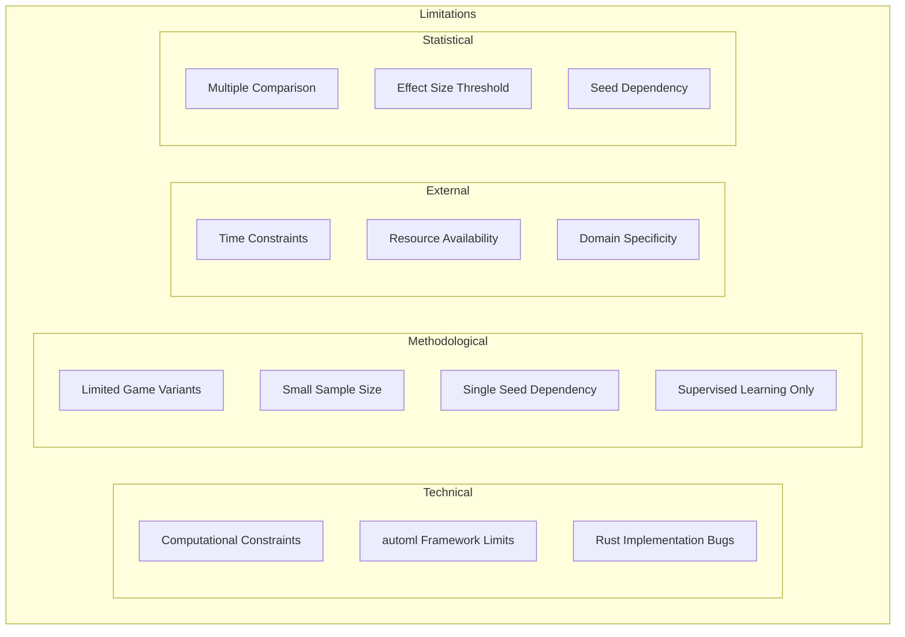

# Plan 03 — Limitations: the repository status is explicit and evidence based

> **Status: PARTIAL (2026-09-26).** Design limitations are documented; empirical trained-policy and full framework limitations remain unknown.

**Goal:** State the current implementation and evidence boundary for limitations.
**Builds on:** [00](../../00-scope-and-traceability.md) — the project is supervised 4×4 2048 policy learning, and framework evaluation is a separate research track.

---

## Decision and evidence

**This plan combines known scope limits with open empirical limits.** A 10,000-game random/heuristic action-frequency study exists, but there is no trained-policy result or full framework benchmark.

> Limits below distinguish observed implementation boundaries from questions that require the planned studies.

## 1. Limitations Framework

## 2. Technical Limitations

| Limitation | Impact | Mitigation | Status |
|-----------|--------|------------|--------|
| Training time | Unknown — to be measured | Parallel training | To be assessed |
| Memory usage | Unknown — to be measured | Model compression | To be assessed |
| AutoML constraints | Root four-action integration currently permits RandomForest, ExtraTrees, AdaBoost, KNN, and NaiveBayes; broader framework behavior needs validation | Use only tested integration candidates and report capability limits | Partly assessed |
| Rust bugs | Potential data corruption | Extensive testing | To be assessed |
| State representation fixed | 17 canonical values; no history or derived model features | Any change requires separately scoped study | Acknowledged |
| No RL methods | Cannot learn from rewards | Future work | Acknowledged |

## 3. Methodological Limitations

- **Limited game variants:** Only standard 4×4 2048 tested
- **No external data:** All data from game simulation
- **Fixed evaluation criteria:** May not capture all performance aspects
- **Sample size:** game count does not establish power or cover rare outcomes; the primary model study has not run
- **Label quality:** Depends on rollout simulation accuracy
- **Feature completeness:** the fixed 17-value input may omit information relevant to the policy; no sufficiency claim is established
- **Supervised learning only:** No reward shaping or policy gradient methods
- **Seed variation:** model robustness across training and evaluation seeds has not been measured
- **Feature engineering fixed:** The canonical 17-value state is predetermined; no derived features or history are included

## 4. Framework Limitations

Capability and probability-shape smokes pass for five four-class candidates. A one-split, two-run standard-dataset diagnostic under AutoML `82d8483` matched 15/15 prediction sets and save/load outputs. Broader framework validation remains open: matched external baselines, resource measurements, broader-seed reliability, and CLI/API equivalence. Group-aware cross-validation is implemented in the integration because the framework scoring helper does not forward groups.

The framework-validation ticket further requires:

1. **API completeness:** Verify `TrainEngine`, `HyperOptX`, `ModelType` enum, and `CrossValidator` exist and are functional
2. **Model coverage:** Confirm at least 4 candidate algorithms are available via `ModelType`
3. **MultiClassification task:** Verify `TaskType::MultiClassification` is supported
4. **Hyperparameter optimization:** Exercise implemented HyperOptX configuration; pruning API is not available
5. **Cross-validation:** Verify `GroupKFold` or equivalent strategy exists

Report capability failures as findings. The core 2048 model training path remains on the AutoML framework; external libraries are comparison baselines only under canonical scope.

## 5. Statistical Limitations

### 6.1 Multiple Comparison Problem

When testing multiple hypotheses simultaneously, the family of comparisons and dependence assumptions matter. The current comparison CLI applies Holm adjustment; do not imply that adjustment resolves design or power limitations.

**Impact:** Some true effects may be missed (Type II error).

**Mitigation:** Report raw and Holm-adjusted p-values with the declared comparison family.

### 6.2 Effect Size

No minimum practically meaningful effect has been declared. Select one before confirmatory comparisons and report effect sizes without treating a conventional category as an automatic gate.

**Impact:** Models with small but consistent improvements may be overlooked.

**Mitigation:** Report effect sizes for all comparisons, not just those meeting the threshold.

### 6.3 Seed Variation

Game and training outcomes may vary by seed. The listed study seed matrix has not been executed and does not by itself establish generalizability.

**Impact:** Results may not generalize to different game instances.

**Mitigation:** Define training and evaluation seed roles and justify repeated runs before data collection.

### 6.4 Sample Size Limitations

No power or precision claim can be made from the planned 10,000-game number. Rare-event coverage depends on the observed distribution and study design.

**Impact:** Tail behavior may be underestimated.

**Mitigation:** Report the summary statistics supported by the analysis code and retain raw score inputs; do not imply unimplemented percentiles.

## 6. Scope Limitations

**In Scope:**
- Standard 4×4 2048
- automl framework (CLI/API only)
- Supervised classification
- 17-value canonical feature vector
- Mean score ranking

**Out of Scope:**
- 2048 variants (8×8, etc.)
- Other games
- Custom ML architectures
- Reinforcement learning
- Deep learning models
- Multi-agent scenarios
- Neural networks
- Raw pixel inputs
- Human gameplay data
- Game UI development
- Model deployment as web service

## 7. Honest Assessment

Known implementation and evidence limits are recorded explicitly:

1. The baseline report measured random and heuristic mean scores of 1,094.12 and 8,056.23 respectively across 10,000 games under its recorded local protocol; these do not represent a trained AutoML policy or framework comparison
2. Results are specific to the 2048 game domain
3. Generalizability to other games is untested
4. Computational constraints may affect optimal model selection
5. The theoretical score bound has not been established in this repository
6. Supervised learning may not capture all aspects of optimal play
7. Model results await full experimentation
8. Feature contribution is unknown; no ablation study has run
9. Multi-seed validation is planned but not yet completed
10. Standard-dataset framework validation remains partial despite the 15/15 repeatability diagnostic; matched baselines and comparative resource measurements remain incomplete
11. PSPACE-hardness is outside core scope and not established here

## 8. Mitigation Strategies (Trimmed — No Generic Filler)

| Limitation | Mitigation |
|-----------|------------|
| Seed variation | Declare separate training/evaluation seeds and replication unit |
| Multiple comparison | Declare comparison family; current CLI reports Holm-adjusted p-values |
| AutoML gaps | Report framework capability failures; keep core training on AutoML per scope |
| 4×4 / supervised / 17-value input fixed | Acknowledged — future n×n/RL is Appendix only |

> Generic rows (training time, PSPACE, 8×8 expansion) deleted — covered in Discussion §7 Future Work and `07-computational-budget.md`.

## 9. Conclusion

Despite limitations, the research provides a rigorous framework for evaluating automl effectiveness for game AI. The limitations are acknowledged and documented transparently. Future work should address these limitations for a more comprehensive understanding.

All results will be reported honestly, including null results and failed experiments. No results are fabricated or selectively reported.

## Implementation Record

- Measured baseline evidence is summarized in `reports/action-frequency/README.md`; its random/heuristic scores are protocol-specific. Trained-policy, standard-dataset framework, and resource limitations remain unresolved.

---

## Verification (definition of done)

1. `test -f plans/08-Research-Report/03-Findings/03-limitations.md` exits 0.
2. `grep -q '^# Plan 03 — ' plans/08-Research-Report/03-Findings/03-limitations.md` exits 0.
3. `grep -q '^> \\*\\*Status:' plans/08-Research-Report/03-Findings/03-limitations.md` exits 0.
4. `grep -q '^\*\*Goal:' plans/08-Research-Report/03-Findings/03-limitations.md` exits 0.
5. `grep -q '^## Decision and evidence$' plans/08-Research-Report/03-Findings/03-limitations.md` exits 0.
6. `grep -q '^## Open questions$' plans/08-Research-Report/03-Findings/03-limitations.md` exits 0.
7. `grep -q '^## Later$' plans/08-Research-Report/03-Findings/03-limitations.md` exits 0.
8. `bash /Users/evintleovonzko/Documents/works/kolosal/planout2/v2-ai-express/.claude/skills/writing-planout-plans/check-plan.sh plans/08-Research-Report/03-Findings/03-limitations.md` exits 0.

## Open questions

- **Open limitations require the pending framework and case-study studies.** Retain raw data, manifests, dependency state, and resource measurements; declare a budget before large collection.

## Later

- **Complete the remaining research or implementation work recorded above.** It stays deferred until its prerequisites, compute budget, and measurable acceptance evidence are available.
