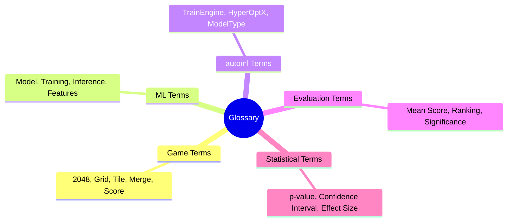
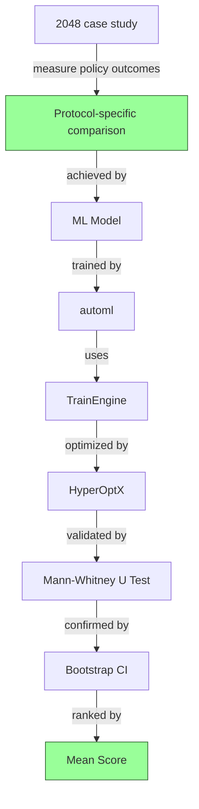

# Plan 02 — Glossary: the repository status is explicit and evidence based

> **Status: PARTIAL (2026-09-26).** Terms are compiled, but several definitions need qualifiers and baseline scores must be tied to their local protocol.

**Goal:** State the current implementation and evidence boundary for glossary.
**Builds on:** [00](../../00-scope-and-traceability.md) — the project is supervised 4×4 2048 policy learning, and framework evaluation is a separate research track.

---

## Decision and evidence

**This glossary is descriptive documentation.** It does not imply that a concept has been measured, proved, or implemented. Experimental results are protocol-specific.

## 1. Purpose

Define key terms and concepts used throughout the 2048 ML research. This glossary includes game terminology, ML terminology, automl framework terms, evaluation terms, and statistical terms.

## 2. Terminology Framework

## 3. Game Terminology

| Term | Definition |
|------|------------|
| 2048 | Tile-matching puzzle game where the goal is to maximize score by merging tiles |
| Grid | 4×4 board for gameplay |
| Tile | Game piece with power-of-2 value |
| Merge | Combine two equal tiles into a higher-value tile |
| Move | Slide operation (up/down/left/right) |
| Score | Sum of all merge values during a game |
| Game Over | Board is full with no valid moves |
| Heuristic Baseline | Local policy using heuristic board evaluation; measured mean is protocol-specific (8,056.23 in the recorded 10k action-frequency study) |
| Random Baseline | Agent selecting a legal move uniformly; measured mean is protocol-specific (1,094.12 in the recorded 10k action-frequency study) |
| Case-study winner | Model with the highest held-out mean score under the declared 2048 protocol; not a globally optimal policy |

## 4. ML Terminology

| Term | Definition |
|------|------------|
| Model | Trained supervised classifier; root four-action integration supports RandomForest, ExtraTrees, AdaBoost, KNN, and NaiveBayes |
| Training | Model learning process from labeled data |
| Inference | Model prediction on new game states |
| Features | Input data representation (27-dimensional feature vector) |
| Labels | Target action selected by rollout mean score; a finite-simulation proxy, not a proven optimal action |
| Loss | Prediction error metric (cross-entropy) |
| Convergence | Training stabilization (diminishing returns pattern) |
| Hyperparameters | Configuration parameters tuned by HyperOptX |
| Feature Vector | 27-dimensional representation of board state |

## 5. automl Framework Terms

| Term | Definition |
|------|------------|
| TrainEngine | Core training component from Evintkoo/automl |
| HyperOptX | Hyperparameter optimization engine (TPE sampler) |
| TrainingConfig | Model configuration settings |
| ModelType | AutoML model selector; root integration accepts five tested four-class candidates |
| SearchSpace | Range of hyperparameters for optimization |
| CrossValidator | AutoML splitter used by the project `src/training.rs` helper to keep game groups out of both sides of a fold |

## 6. Evaluation Terms

| Term | Definition |
|------|------------|
| Benchmark | Standard for comparison (heuristic agent, random agent) |
| Baseline | Reference policy measured under a declared, reproducible protocol |
| Metric | Quantitative measurement (mean score, median score, std dev) |
| Statistical significance | Decision under a declared test, comparison family, and error criterion; no universal project threshold is fixed here |
| Reproducibility | Consistent results with fixed seed |
| Winner Determination | Protocol-specific comparison; no trained-policy winner has been established |
| Mean Score | Primary 2048 case-study metric; framework validation uses task-appropriate quality and resource metrics |
| Bootstrap CI | 95% confidence interval via resampling |
| Effect Size | Magnitude of difference; Cohen's d helper exists, with no automatic project cutoff |

## 7. Statistical Terms

| Term | Definition |
|------|------------|
| p-value | Probability of observing results under null hypothesis |
| Confidence Interval | Range of true value estimate (95% bootstrap CI) |
| Effect Size | Magnitude of difference (Cohen's d) |
| Standard Deviation | Data spread measure |
| Wilcoxon | Paired rank test; not implemented in current comparison helpers |
| Mann-Whitney U | Two-group non-parametric comparison |
| Kruskal-Wallis | Multi-group rank test; not implemented in current comparison helpers |
| Bonferroni | Multiple comparison correction |
| Holm-Bonferroni | Less conservative multiple comparison correction |
| Power | Probability of detecting a specified effect under assumptions; no project power analysis has been completed |

## 8. Theoretical Terms

| Term | Definition |
|------|------------|
| MDP | Markov decision process; the simulator exposes the board state and randomizes spawns |
| POMDP | Partially observable Markov decision process; not the current 2048 formulation |
| PSPACE-hard | Computationally intractable problem class |
| Markov Blanket | Minimal feature subset sufficient for prediction |
| PAC-learning | Probably approximately correct learning framework |
| VC-dimension | Measure of hypothesis class complexity |
| Mutual Information | Information shared between two variables |
| Entropy | Measure of uncertainty in a system |
| Bellman Equation | Recursive equation for value function |

## 9. Rust-Specific Terms

| Term | Definition |
|------|------------|
| Option<T> | Nullable type |
| Result<T,E> | Error handling type |
| trait | Interface definition |
| impl | Implementation block |
| generics | Parametric polymorphism |
| lifetime | Ownership scope annotation |
| borrow | Reference without ownership |
| move | Transfer of ownership |

## 10. Quick Reference

## 11. Reference to Theoretical Framework

For the current theory outline, see `00-theoretical-framework.md`. Its appendix references are not validated formal results; the game is described as fully observed, and PSPACE, feature-sufficiency, PAC, and entropy claims are excluded pending proof and source review.

## Implementation Record

- Glossary is a documentation aid only. Corrected baseline values to the recorded local protocol, described labels as rollout proxies, and marked unimplemented tests and unproven theories as such.

---

## Verification (definition of done)

1. `test -f plans/08-Research-Report/04-Appendix/02-glossary.md` exits 0.
2. `grep -q '^# Plan 02 — ' plans/08-Research-Report/04-Appendix/02-glossary.md` exits 0.
3. `grep -q '^> \\*\\*Status:' plans/08-Research-Report/04-Appendix/02-glossary.md` exits 0.
4. `grep -q '^\*\*Goal:' plans/08-Research-Report/04-Appendix/02-glossary.md` exits 0.
5. `grep -q '^## Decision and evidence$' plans/08-Research-Report/04-Appendix/02-glossary.md` exits 0.
6. `grep -q '^## Open questions$' plans/08-Research-Report/04-Appendix/02-glossary.md` exits 0.
7. `grep -q '^## Later$' plans/08-Research-Report/04-Appendix/02-glossary.md` exits 0.
8. `bash /Users/evintleovonzko/Documents/works/kolosal/planout2/v2-ai-express/.claude/skills/writing-planout-plans/check-plan.sh plans/08-Research-Report/04-Appendix/02-glossary.md` exits 0.

## Open questions

- **Definitions remain bounded by source and study evidence.** Update terms when the implemented API or protocol changes; do not use glossary shorthand as an empirical claim.

## Later

- **Complete the remaining research or implementation work recorded above.** It stays deferred until its prerequisites, compute budget, and measurable acceptance evidence are available.
