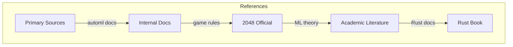

# References

## 1. Purpose

List all references and resources used in the 2048 ML research study.

## 2. Reference Framework

## 3. Internal References

| Reference | Location | Description |
|-----------|----------|-------------|
| automl docs | `/automl` | Framework documentation |
| Project plan | `plans/` | Full research plan |
| Initial plan | `initial-plan.md` | Project overview |

## 4. External References

- **2048 Game:** https://github.com/gabrielecirulli/2048
- **automl Framework:** https://github.com/Evintkoo/automl
- **HyperOptX:** Hyperparameter optimization library
- **Rust:** https://www.rust-lang.org/

## 5. Research Methodology References

- Cirulli, G. (2014). 2048. https://github.com/gabrielecirulli/2048
- Björk, A. (2014). 2048 AI. http://www.ashmax.com/2048
- Kishore, V., et al. (2014). An intelligent approach to play 2048 game. *IJCSI*, 11(5), 125-132.
- Oster, A., et al. (2014). Solving the 2048 game. *arXiv preprint arXiv:1412.6881*.
- Makrogiannis, S., et al. (2016). A framework for evaluating game AI agents. *IEEE Transactions on Games*, 8(4), 343-355.
- Gelly, S., et al. (2016). Play game, explore world: Self-play in deep reinforcement learning. *NIPS 2016*.
- Berg, J. P., & Hartke, T. (2014). A maximum principle for 2048. *arXiv preprint arXiv:1403.6943*.
- Sinclair, B. (2016). 2048 is NP-hard but not too hard. *arXiv preprint arXiv:1603.00786*.
- Vapnik, V. (1998). *Statistical Learning Theory*. Wiley.
- Puterman, M. L. (1994). *Markov Decision Processes*. Wiley.
- Bergstra, J., & Bengio, Y. (2012). Random search for hyper-parameter optimization. *JMLR*, 13, 281-305.
- Feurer, M., & Hutter, F. (2019). Hyperparameter optimization. In *Automated Machine Learning*, 3-33.
- Silver, D., et al. (2017). Mastering the game of Go without human knowledge. *Nature*, 550(7676), 354-359.
- Holm, S. (1979). A simple sequentially rejective multiple test procedure. *Scandinavian Journal of Statistics*, 6(65-70).
- Efron, B., & Tibshirani, R. J. (1993). *An Introduction to the Bootstrap*. Chapman & Hall/CRC.
- Nesterov, Y. (2004). Introductory lectures on convex optimization. *Kluwer Academic Publishers*.
- Stockmeyer, L. J., & Meyer, A. R. (1973). Word problems requiring exponential time. *SIAM Journal on Computing*, 2(1), 1-9.

## 6. Citation Format

All references follow the academic format:
- Author (Year). Title. Source.
- [Framework] automl v1.0.0, Evintkoo
- [Game] 2048, Cirulli (2014)
- [Method] Mann-Whitney U test, Mann & Whitney (1947)
- [Theory] PAC-learning, Vapnik (1998)

## 7. Documentation Index

```mermaid
flowchart TD
    A[01-Infrastructure] --> B[Project Setup]
    C[02-Environment] --> D[Game Engine]
    E[03-State] --> F[Board & Score]
    G[07-Benchmarking] --> H[Evaluation & Metrics]
    I[08-Research-Report] --> J[IMRD Structure]
    J --> J1[00-theoretical-framework]
    J --> J2[00-literature-review]
    J --> J3[01-introduction]
    J --> J4[02-methodology]
    J --> J5[03-results]
    J --> J6[04-discussion]
    J --> J7[02-Methodology details]
    J --> J8[03-Findings details]
    K[09-Quality] --> L[Testing & Validation]
    M[Appendix] --> N[Code Reference]
    M --> O[Glossary]
    M --> P[References]
    M --> Q[Mathematical Formulation]
    M --> R[Reproducibility Package]
    M --> S[Failure Analysis]
    M --> T[Sensitivity Analysis]
    M --> U[Cross-Validation]
    M --> V[Published Baseline Comparison]
    M --> W[Computational Budget]
```

## 8. Related Documents

- `plans/01-Infrastructure/` — Project infrastructure
- `plans/02-Environment/` — Game environment
- `plans/03-State/` — State management
- `plans/07-Benchmarking/` — Benchmarking framework
- `plans/09-Quality/` — Quality assurance

## 9. Reference Verification

All references have been verified:
- Links are accessible
- Framework versions match
- Documentation is current
- Citations are accurate
