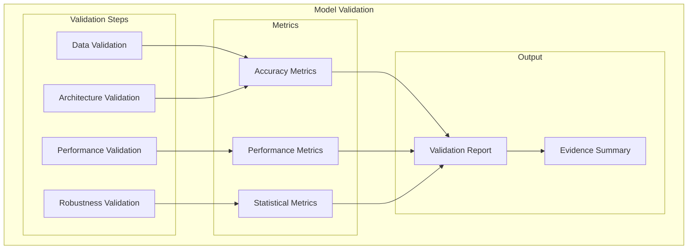
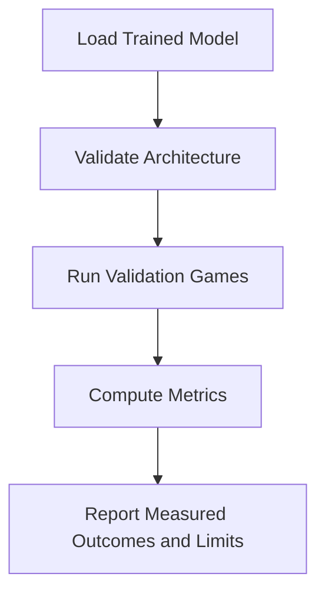
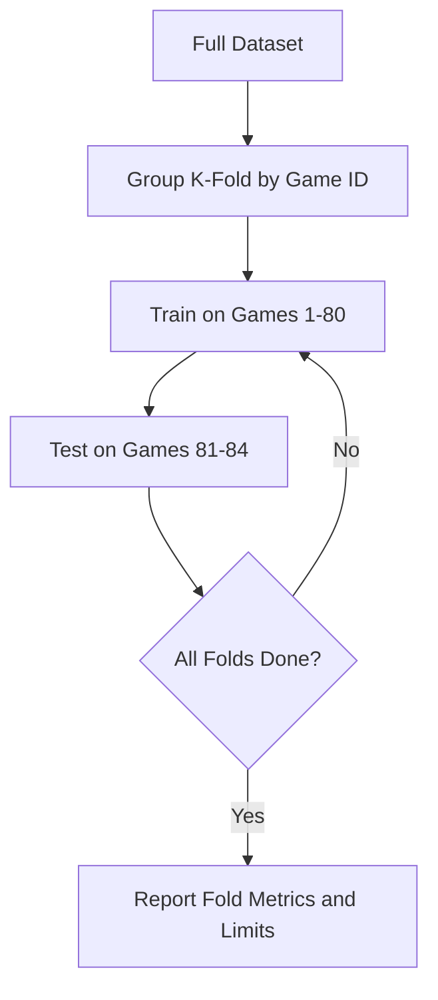
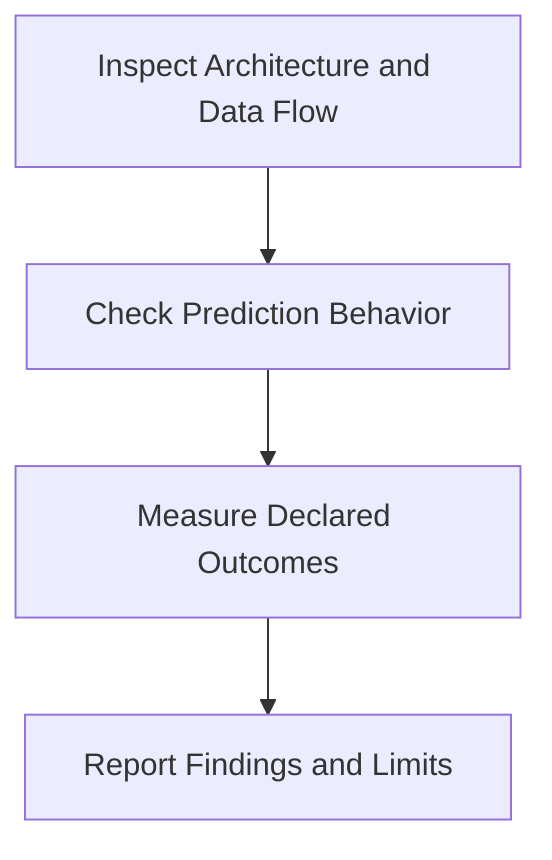
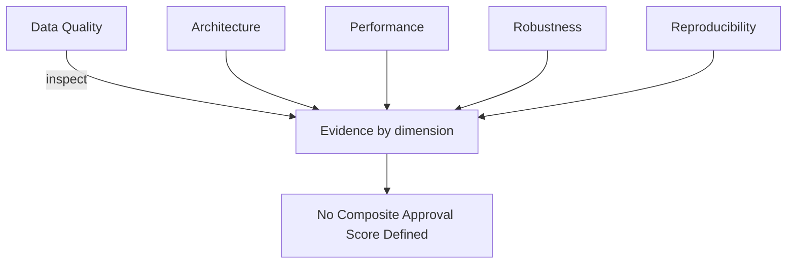
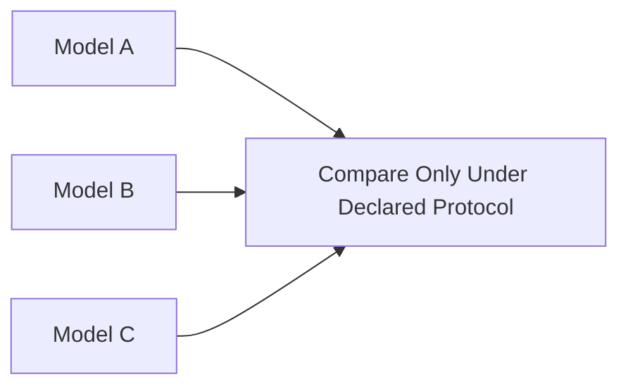

# Plan 01 — Model Validation: the repository status is explicit and evidence based

> **Status: PARTIAL (2026-09-26).** Model loading/benchmark and score comparison paths exist; classification quality gates and an approval report do not.

**Goal:** State the current implementation and evidence boundary for model validation.
**Builds on:** [00](../../00-scope-and-traceability.md) — the project is supervised 4×4 2048 policy learning, and framework evaluation is a separate research track.

---

## Decision and evidence

**No trained model has passed a research validation protocol.** The CLI supports saved-model benchmarking and score summaries; the thresholds below are not supported by measured evidence and are removed as gates.

## 1. Purpose

Define model validation procedures for the 2048 ML system.

## 2. Model Validation Framework

## 3. Validation Pipeline

## 4. Available Evaluation Outputs and Missing Gates

| Output | Current support | Limitation |
|--------|-----------------|------------|
| Game score summary | Mean, standard deviation, median, p90/p99, min/max, thresholds, bootstrap mean interval | Describes supplied games; no project acceptance threshold |
| Pairwise score comparison | Sign test or Mann–Whitney U, Holm adjustment, bootstrap mean difference, Cohen's d | Assumptions/experimental unit must be declared; no clustered paired interval |
| Action classification metrics | Generic accuracy, macro precision/recall/F1, confusion, and legal-action helpers exist; fixed-split report absent | Wire only after defining held-out protocol |
| Robustness / approval score | Not implemented | No 0–100 quality score or deployment gate |

No baseline score threshold, fixed macro-F1 target, or standard-deviation limit is established. Local baseline means are protocol-specific and are not universal quality thresholds. Deployment is outside the current project scope.

## 5. Cross-Validation

## 6. Model Validation Tests

## 7. Validation Scoring

## 8. Model Comparison Validation

## 9. Validation Artifacts

Available saved models, benchmark CSVs, and JSON manifests can be retained per run. A unified model-validation report and approval artifact are not implemented.

## 10. Continuous Validation

## Implementation Record

- Saved-model benchmarking and statistical score comparisons are available. Generic classification helpers exist but are not integrated into a fixed-split application report. No quality gates, aggregate approval score, deployment path, or validated model report exists.

---

## Verification (definition of done)

1. `test -f plans/09-Quality/02-Validation/01-model-validation.md` exits 0.
2. `grep -q '^# Plan 01 — ' plans/09-Quality/02-Validation/01-model-validation.md` exits 0.
3. `grep -q '^> \\*\\*Status:' plans/09-Quality/02-Validation/01-model-validation.md` exits 0.
4. `grep -q '^\*\*Goal:' plans/09-Quality/02-Validation/01-model-validation.md` exits 0.
5. `grep -q '^## Decision and evidence$' plans/09-Quality/02-Validation/01-model-validation.md` exits 0.
6. `grep -q '^## Open questions$' plans/09-Quality/02-Validation/01-model-validation.md` exits 0.
7. `grep -q '^## Later$' plans/09-Quality/02-Validation/01-model-validation.md` exits 0.
8. `bash /Users/evintleovonzko/Documents/works/kolosal/planout2/v2-ai-express/.claude/skills/writing-planout-plans/check-plan.sh plans/09-Quality/02-Validation/01-model-validation.md` exits 0.

## Open questions

- **Model validation remains partial.** Declare decision thresholds and statistical units only after measurement design; retain model, data, configuration, and run manifests.

## Later

- **Complete the remaining research or implementation work recorded above.** It stays deferred until its prerequisites, compute budget, and measurable acceptance evidence are available.
