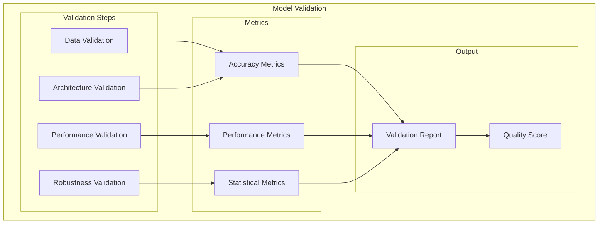
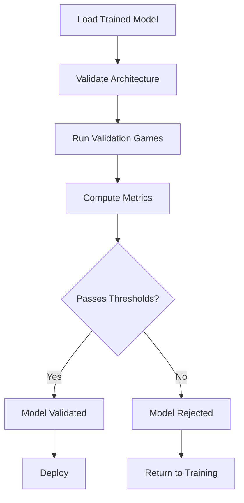
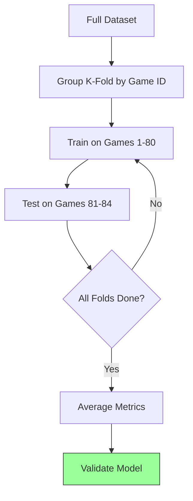
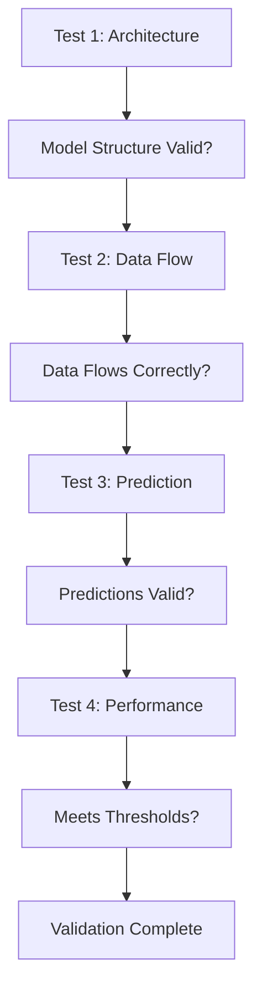
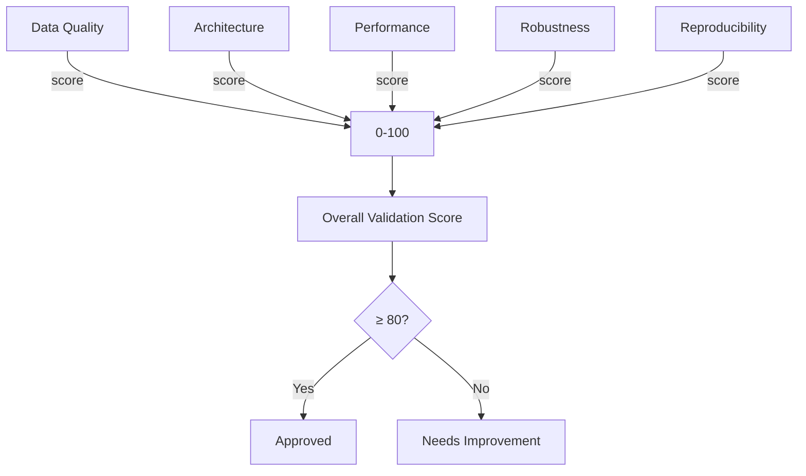
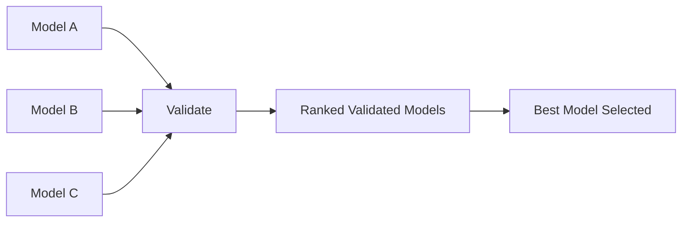
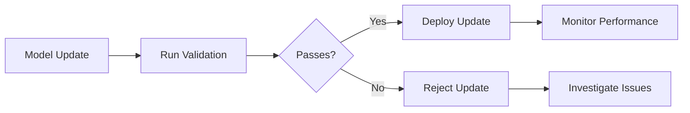

# Plan 01 — Model Validation: the repository status is explicit and evidence based

> **Status: PLANNED.** Not yet restarted in strict sequence.

**Goal:** State the current implementation and evidence boundary for model validation.
**Builds on:** [00](../../00-scope-and-traceability.md) — the project is supervised 4×4 2048 policy learning, and framework evaluation is a separate research track.

---

## Decision and evidence

**This plan treats its subject as partial or pending work, not as a research finding.** The rejected alternative is to infer completion from a plan title or related code alone. The ledger records this disposition: Not yet restarted in strict sequence.

## 1. Purpose

Define model validation procedures for the 2048 ML system.

## 2. Model Validation Framework

## 3. Validation Pipeline

## 4. Validation Metrics — Canonical Thresholds

| Metric | Threshold | Method | Gate? |
|--------|-----------|--------|-------|
| Mean Game Score | ≥ 512 (beats heuristic ~512) | Statistical evaluation (Mann-Whitney U, Bonferroni) | **Primary gate — rank by mean score** |
| Valid-Action Accuracy | ≥ 60% | Classification accuracy on valid actions only (0–3) | **Gate** |
| F1 Macro | ≥ 0.55 | Macro-averaged F1 across 4 action classes | **Gate** |
| Robustness | Std Dev ≤ 512 | Variance analysis | Informative |

> **No proximity gate.** Models are **ranked by Mean Game Score** (highest wins). If proximity is reported as optional analysis, define as **single value** `proximity = model_mean_score / heuristic_baseline_mean (≈512)` (e.g., 768 → 1.5×). Do not use `≥1.5` proximity as pipeline rejection gate; `≥0.3/>0.5` deprecated and removed. No `model/theoretical_max` ratio — theoretical max is open.

## 5. Cross-Validation

## 6. Model Validation Tests

## 7. Validation Scoring

## 8. Model Comparison Validation

## 9. Validation Artifacts

All validation artifacts are stored:
- Model checkpoints
- Validation metrics
- Test configurations
- Results summaries

## 10. Continuous Validation

## Implementation Record

- Saved-model benchmarking and statistical score comparisons are available, but there is no validation command that computes the specified classification gates or produces an approval report. No model is validated against the plan thresholds yet.

---

## Verification (definition of done)

1. `test -f plans/09-Quality/02-Validation/01-model-validation.md` exits 0.
2. `grep -q '^# Plan 01 — ' plans/09-Quality/02-Validation/01-model-validation.md` exits 0.
3. `grep -q '^> \\*\\*Status:' plans/09-Quality/02-Validation/01-model-validation.md` exits 0.
4. `grep -q '^\*\*Goal:' plans/09-Quality/02-Validation/01-model-validation.md` exits 0.
5. `grep -q '^## Decision and evidence$' plans/09-Quality/02-Validation/01-model-validation.md` exits 0.
6. `grep -q '^## Open questions$' plans/09-Quality/02-Validation/01-model-validation.md` exits 0.
7. `grep -q '^## Later$' plans/09-Quality/02-Validation/01-model-validation.md` exits 0.
8. `bash /Users/evintleovonzko/Documents/works/kolosal/planout2/v2-ai-express/.claude/skills/writing-planout-plans/check-plan.sh plans/09-Quality/02-Validation/01-model-validation.md` exits 0.

## Open questions

- **The plan-scale evidence remains bounded by current results.** Not yet restarted in strict sequence. Any larger corpus or external benchmark needs a declared resource budget and retained artifacts.

## Later

- **Complete the remaining research or implementation work recorded above.** It stays deferred until its prerequisites, compute budget, and measurable acceptance evidence are available.
