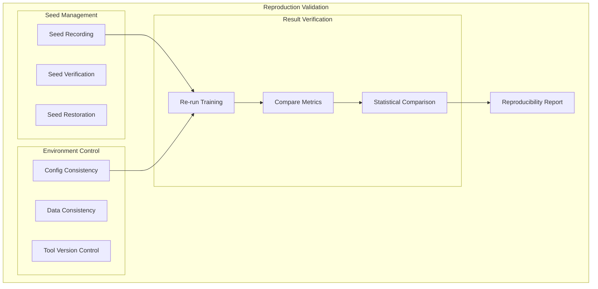
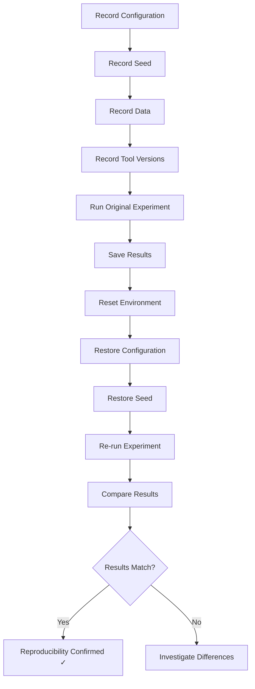
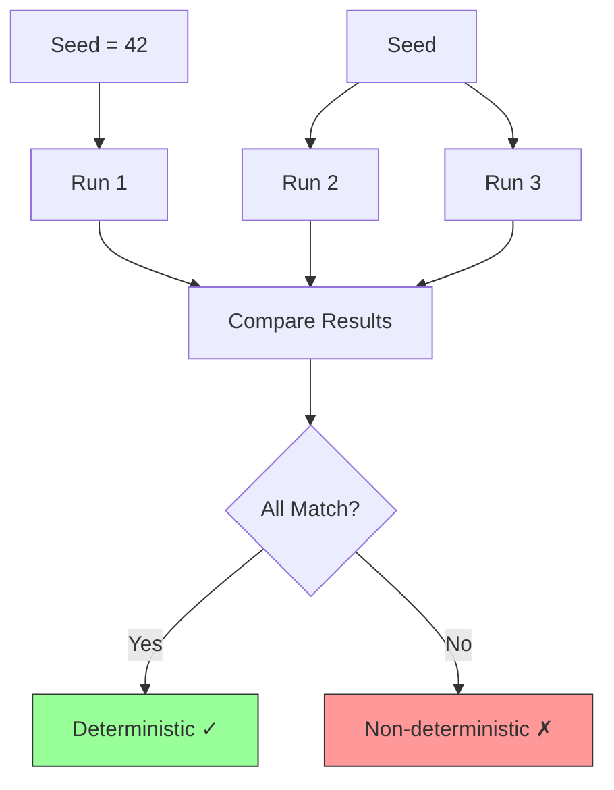
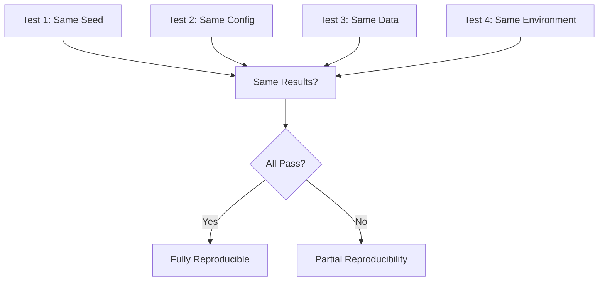
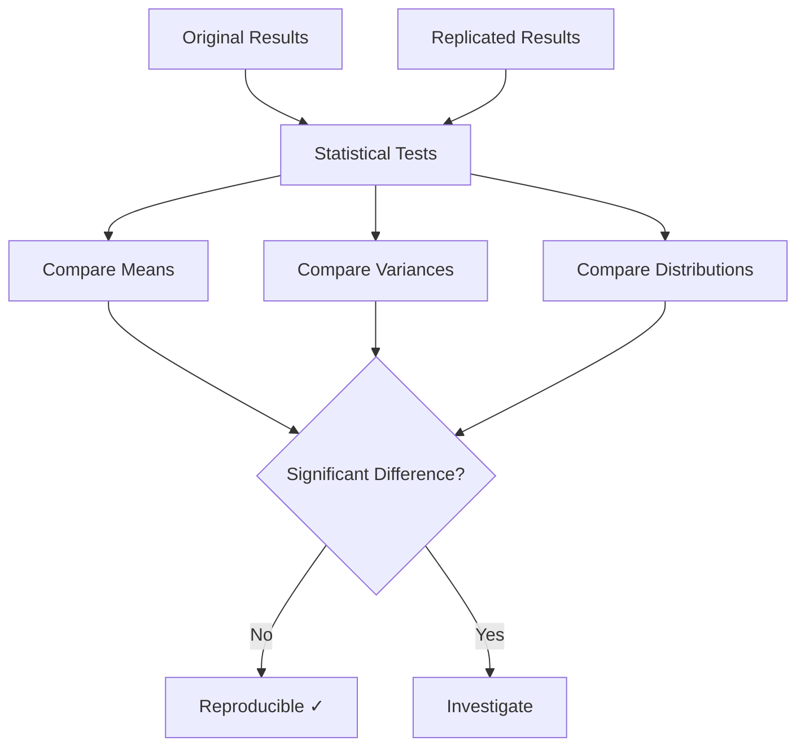
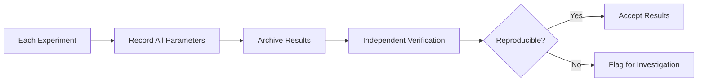

# Reproduction Validation

## 1. Purpose

Define reproduction validation procedures to ensure research results are reproducible.

## 2. Reproduction Validation Framework



## 3. Reproduction Pipeline



## 4. Seed-Based Reproduction



## 5. Configuration Reproducibility

| Configuration Element | Reproducible | Verification Method |
|----------------------|-------------|-------------------|
| TrainingConfig | Yes | Checksum comparison |
| HyperOptX settings | Yes | Seed + parameters |
| Game Engine | Yes | Version pinned |
| Data Pipeline | Yes | Fixed data source |
| Random Seed | Yes | Seed recorded |

## 6. Reproduction Test Matrix



## 7. Statistical Reproducibility



## 8. Reproducibility Metrics

```rust
pub struct ReproducibilityResult {
    pub seed: u64,
    pub original_mean: f64,
    pub replicated_mean: f64,
    pub difference: f64,
    pub p_value: f64,
    pub is_reproducible: bool,
    pub confidence_level: f64,
    pub runs_compared: usize,
}

impl ReproducibilityResult {
    pub fn evaluate(&self) -> bool {
        self.p_value > 0.05 && (self.difference / self.original_mean).abs() < 0.01
    }
}
```

## 9. Reproducibility Checklist

- [ ] Seed recorded and verified
- [ ] Configuration documented
- [ ] Data source fixed
- [ ] Tool versions pinned
- [ ] Environment reproducible
- [ ] Results verified by independent run

## 10. Continuous Reproducibility


