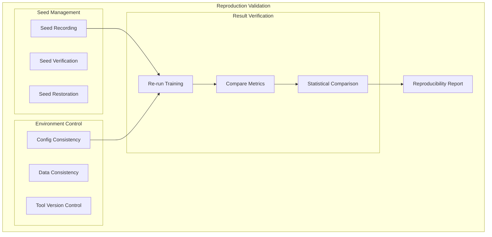
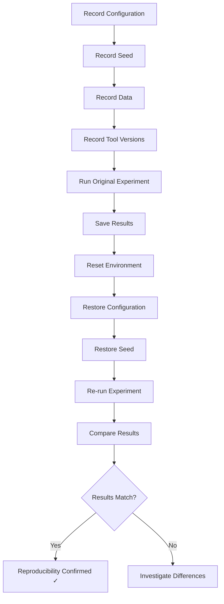
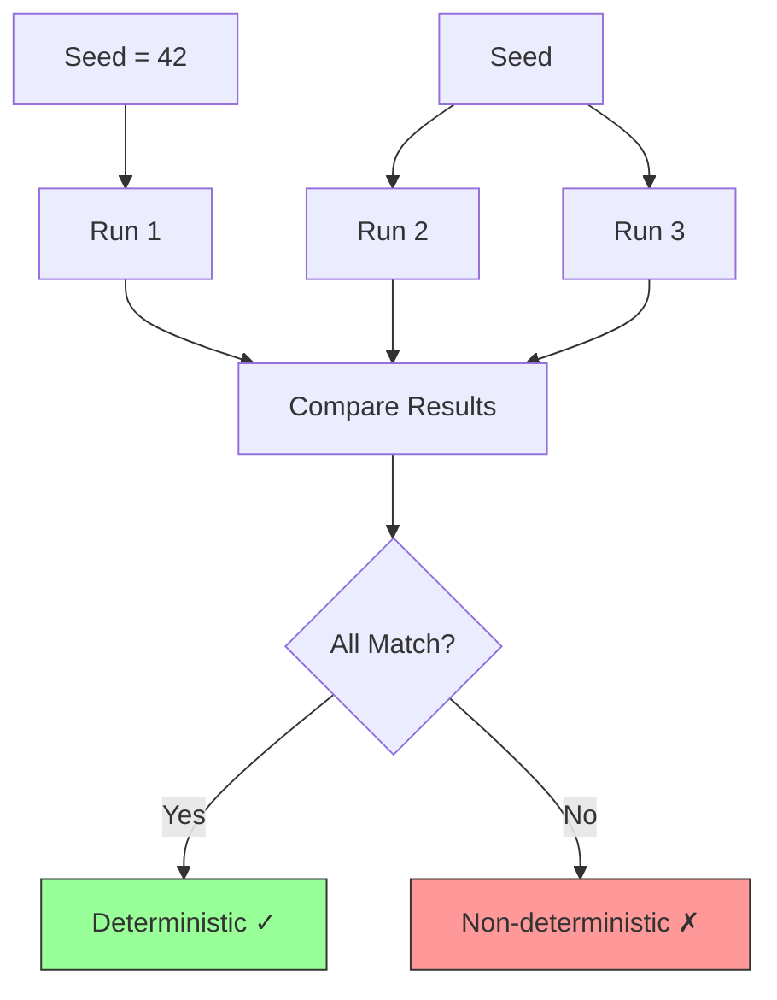
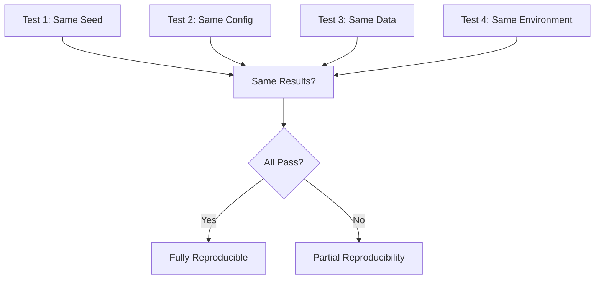
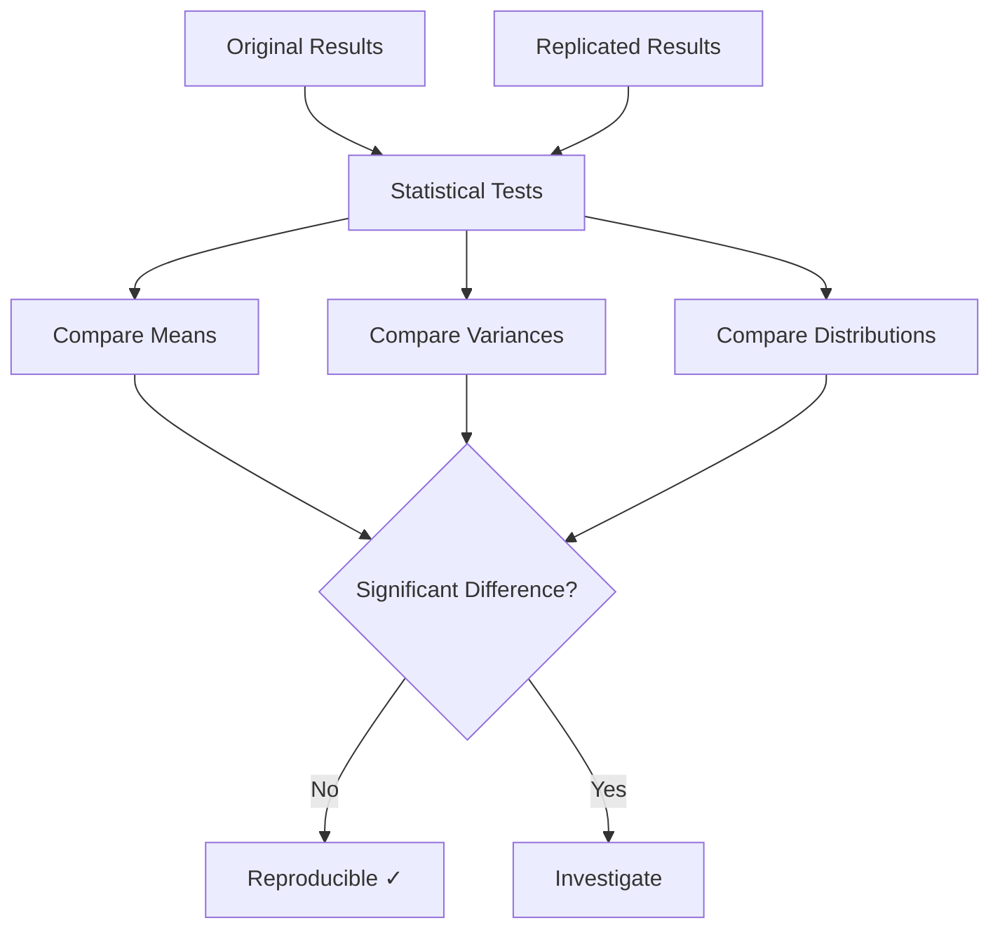
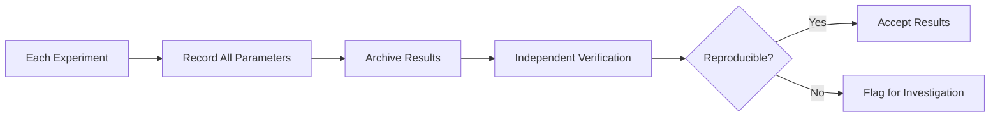

# Plan 03 — Reproduction Validation: the repository status is explicit and evidence based

> **Status: PLANNED.** Not yet restarted in strict sequence.

**Goal:** State the current implementation and evidence boundary for reproduction validation.
**Builds on:** [00](../../00-scope-and-traceability.md) — the project is supervised 4×4 2048 policy learning, and framework evaluation is a separate research track.

---

## Decision and evidence

**This plan treats its subject as partial or pending work, not as a research finding.** The rejected alternative is to infer completion from a plan title or related code alone. The ledger records this disposition: Not yet restarted in strict sequence.

## 1. Purpose

Define reproduction validation procedures to ensure research results are reproducible.

## 2. Reproduction Validation Framework



## 3. Reproduction Pipeline



## 4. Seed-Based Reproduction



## 5. Configuration Reproducibility

| Configuration Element | Reproducible | Verification Method |
|----------------------|-------------|-------------------|
| TrainingConfig | Yes | Checksum comparison |
| HyperOptX settings | Yes | Seed + parameters |
| Game Engine | Yes | Version pinned |
| Data Pipeline | Yes | Fixed data source |
| Random Seed | Yes | Seed recorded |

## 6. Reproduction Test Matrix



## 7. Statistical Reproducibility



## 8. Reproducibility Metrics

```rust
pub struct ReproducibilityResult {
    pub seed: u64,
    pub original_mean: f64,
    pub replicated_mean: f64,
    pub difference: f64,
    pub p_value: f64,
    pub is_reproducible: bool,
    pub confidence_level: f64,
    pub runs_compared: usize,
}

impl ReproducibilityResult {
    pub fn evaluate(&self) -> bool {
        self.p_value > 0.05 && (self.difference / self.original_mean).abs() < 0.01
    }
}
```

## 9. Reproducibility Checklist

- [ ] Seed recorded and verified
- [ ] Configuration documented
- [ ] Data source fixed
- [ ] Tool versions pinned
- [ ] Environment reproducible
- [ ] Results verified by independent run

## 10. Continuous Reproducibility



## Implementation Record

- Same-seed simulation and batch outputs have automated checks; run manifests store seed/config/provenance and hashes. No independent dataset/model reproduction report or repeated full-training run has been completed. The fixed 1%/p-value rule is not a validated general reproducibility criterion.

---

## Verification (definition of done)

1. `test -f plans/09-Quality/02-Validation/03-reproduction-validation.md` exits 0.
2. `grep -q '^# Plan 03 — ' plans/09-Quality/02-Validation/03-reproduction-validation.md` exits 0.
3. `grep -q '^> \\*\\*Status:' plans/09-Quality/02-Validation/03-reproduction-validation.md` exits 0.
4. `grep -q '^\*\*Goal:' plans/09-Quality/02-Validation/03-reproduction-validation.md` exits 0.
5. `grep -q '^## Decision and evidence$' plans/09-Quality/02-Validation/03-reproduction-validation.md` exits 0.
6. `grep -q '^## Open questions$' plans/09-Quality/02-Validation/03-reproduction-validation.md` exits 0.
7. `grep -q '^## Later$' plans/09-Quality/02-Validation/03-reproduction-validation.md` exits 0.
8. `bash /Users/evintleovonzko/Documents/works/kolosal/planout2/v2-ai-express/.claude/skills/writing-planout-plans/check-plan.sh plans/09-Quality/02-Validation/03-reproduction-validation.md` exits 0.

## Open questions

- **The plan-scale evidence remains bounded by current results.** Not yet restarted in strict sequence. Any larger corpus or external benchmark needs a declared resource budget and retained artifacts.

## Later

- **Complete the remaining research or implementation work recorded above.** It stays deferred until its prerequisites, compute budget, and measurable acceptance evidence are available.
