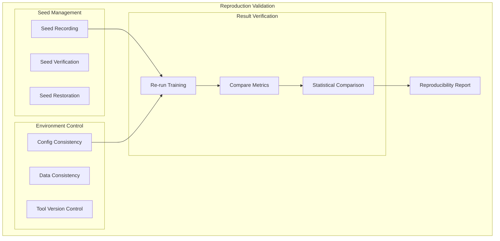
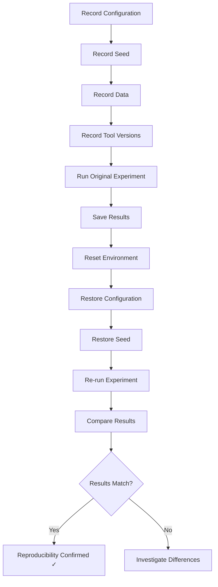
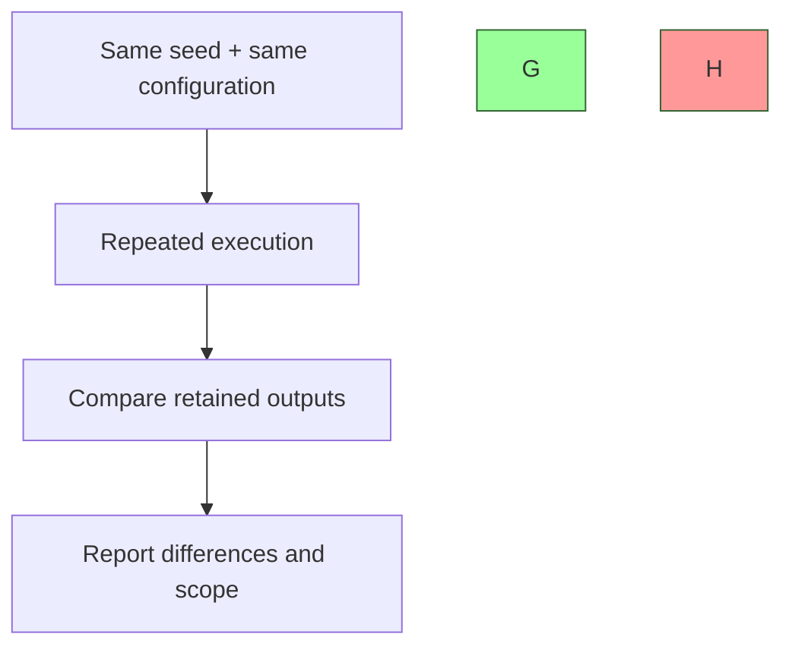
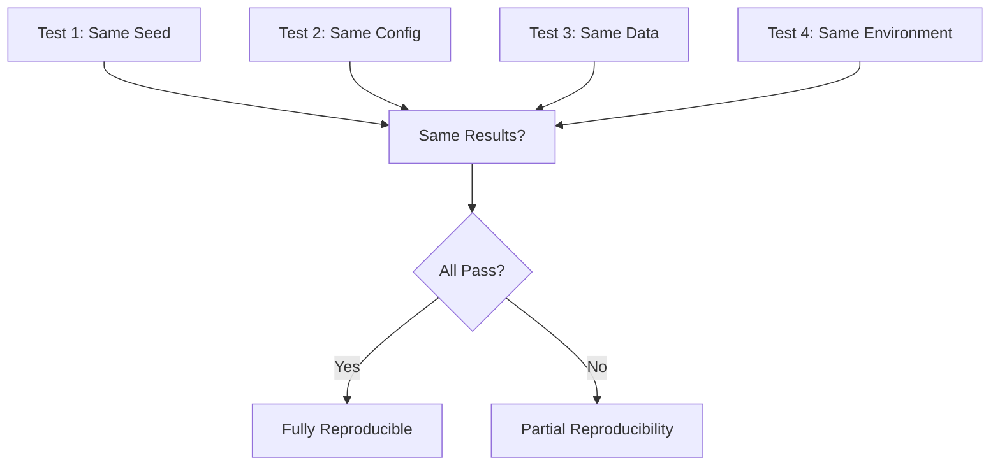
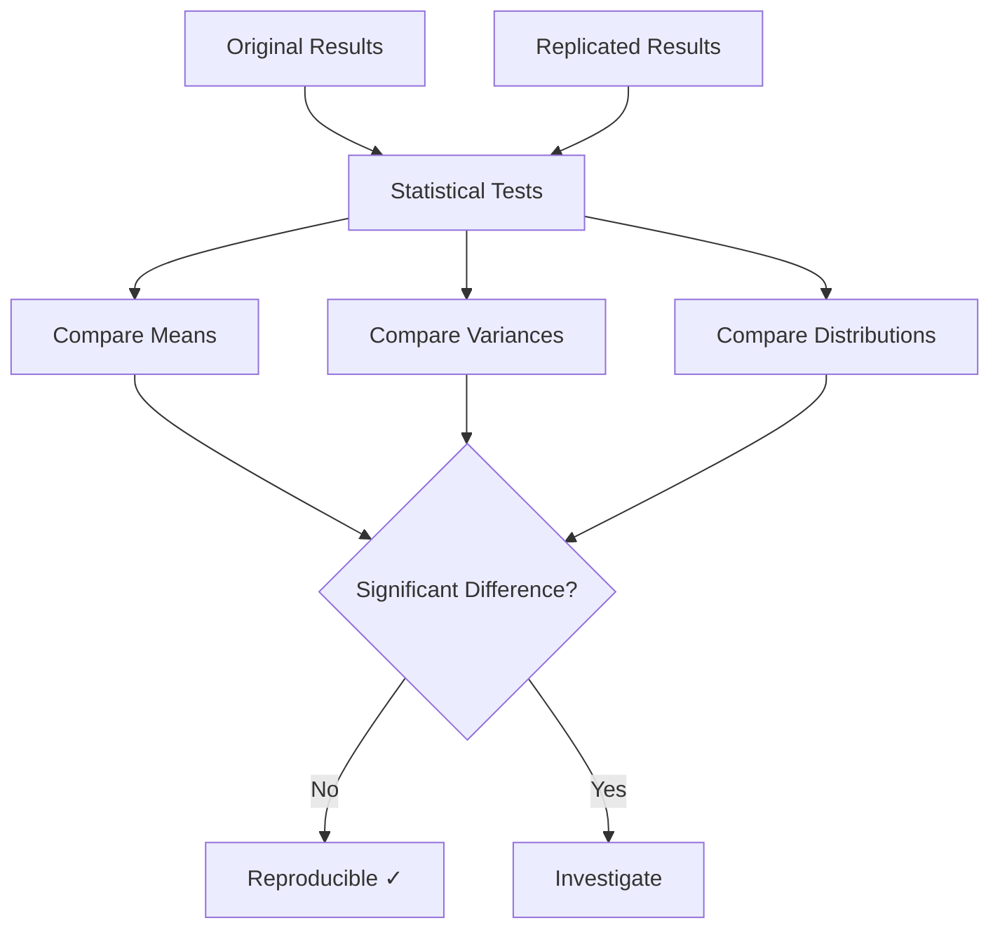
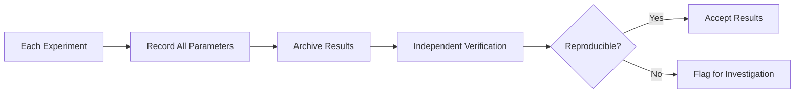

# Plan 03 — Reproduction Validation: the repository status is explicit and evidence based

> **Status: PARTIAL (2026-09-26).** Seeded simulator/collection checks and run manifests exist; independent full-training reproduction has not been demonstrated.

**Goal:** State the current implementation and evidence boundary for reproduction validation.
**Builds on:** [00](../../00-scope-and-traceability.md) — the project is supervised 4×4 2048 policy learning, and framework evaluation is a separate research track.

---

## Decision and evidence

**Deterministic helper checks are narrower than research reproducibility.** No repeated full-training or independent reproduction study is available, and no universal pass threshold has been established.

## 1. Purpose

Define reproduction validation procedures to ensure research results are reproducible.

## 2. Reproduction Validation Framework

## 3. Reproduction Pipeline

## 4. Seed-Based Reproduction

## 5. Configuration and Provenance

| Configuration Element | Reproducible | Verification Method |
|----------------------|-------------|-------------------|
| Training configuration | Record in manifest | Compare config digest and resolved parameters |
| HyperOptX settings | Schema/config available for supported paths | Retain config, seed, and study artifacts |
| Game Engine | Record source revision | Root revision and source state |
| Data Pipeline | Record input/output hashes | Retain CSV and metadata provenance |
| Random Seed | Record role-specific seeds | Distinguish collection, training, evaluation, and bootstrap seeds |

## 6. Reproduction Test Matrix

## 7. Statistical Reproducibility

## 8. Reproducibility Metrics

No generic `ReproducibilityResult` evaluator or fixed 1%/p-value rule exists. For repeated runs, declare the independent replication unit and practical tolerance before comparing outcomes. Report exact differences and uncertainty rather than reducing reproducibility to a binary label.

## 9. Reproducibility Checklist

- [ ] Seed recorded and verified
- [ ] Configuration documented
- [ ] Data source fixed
- [ ] Tool versions pinned
- [ ] Environment reproducible
- [ ] Results verified by independent run

## 10. Continuous Reproducibility

## Implementation Record

- Same-seed simulation/batch checks exist, and manifests store configured seeds, protocol, checksums, and provenance. Root `cargo test` passed 34/34, including seed checks. No repeated full-training or independent dataset/model reproduction study has been completed; no fixed 1%/p-value criterion is supported.

---

## Verification (definition of done)

1. `test -f plans/09-Quality/02-Validation/03-reproduction-validation.md` exits 0.
2. `grep -q '^# Plan 03 — ' plans/09-Quality/02-Validation/03-reproduction-validation.md` exits 0.
3. `grep -q '^> \\*\\*Status:' plans/09-Quality/02-Validation/03-reproduction-validation.md` exits 0.
4. `grep -q '^\*\*Goal:' plans/09-Quality/02-Validation/03-reproduction-validation.md` exits 0.
5. `grep -q '^## Decision and evidence$' plans/09-Quality/02-Validation/03-reproduction-validation.md` exits 0.
6. `grep -q '^## Open questions$' plans/09-Quality/02-Validation/03-reproduction-validation.md` exits 0.
7. `grep -q '^## Later$' plans/09-Quality/02-Validation/03-reproduction-validation.md` exits 0.
8. `bash /Users/evintleovonzko/Documents/works/kolosal/planout2/v2-ai-express/.claude/skills/writing-planout-plans/check-plan.sh plans/09-Quality/02-Validation/03-reproduction-validation.md` exits 0.

## Open questions

- **Research reproducibility remains pending.** Retain source, submodule, toolchain, data, config, and output state; design independent repetition around the actual experimental unit.

## Later

- **Complete the remaining research or implementation work recorded above.** It stays deferred until its prerequisites, compute budget, and measurable acceptance evidence are available.
