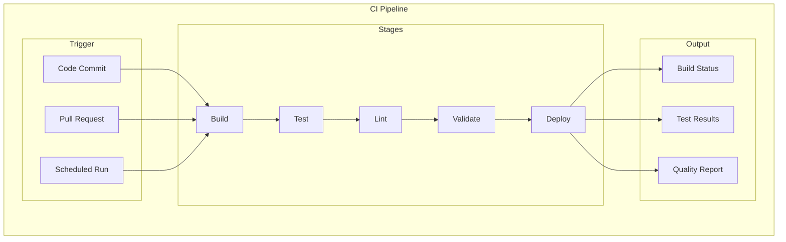
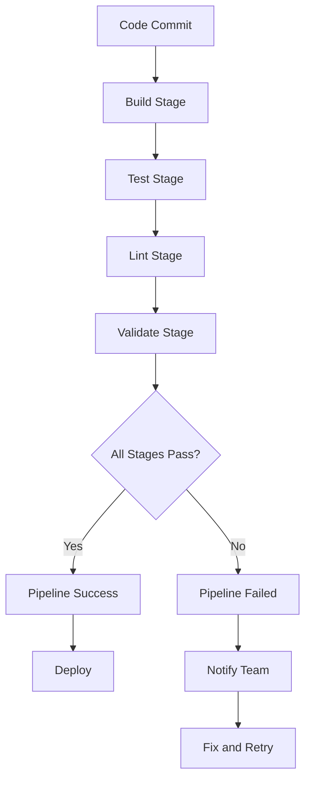
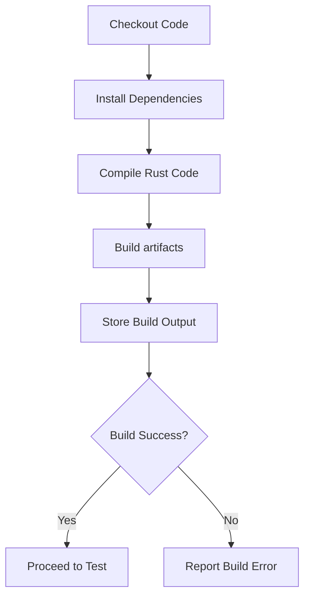
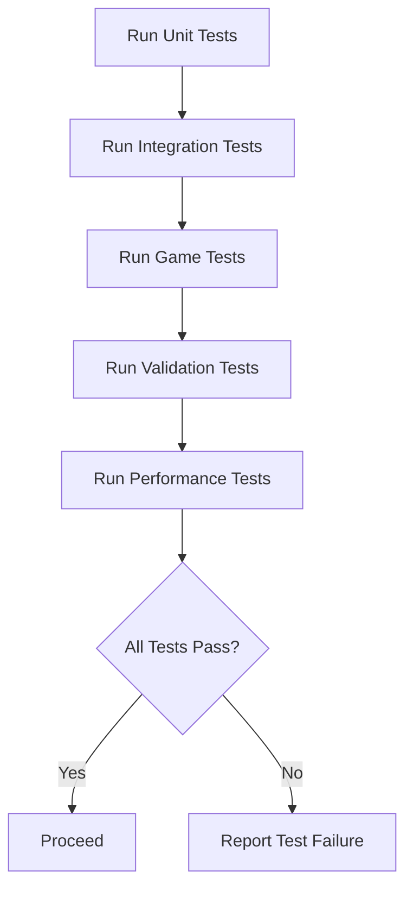
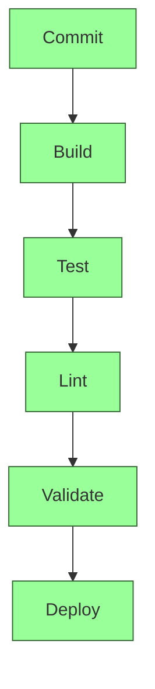
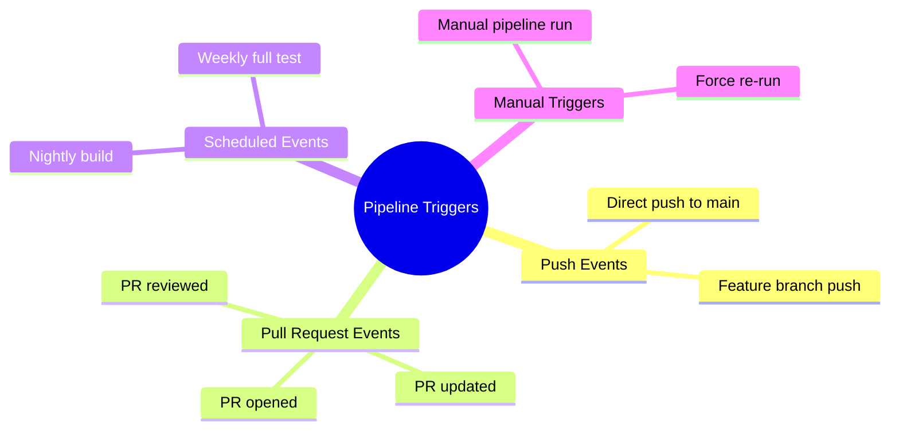

# Plan 01 — CI Pipeline: the repository status is explicit and evidence based

> **Status: PARTIAL (2026-09-26).** No CI workflow exists; this ticket remains an unimplemented infrastructure deliverable.

**Goal:** State the current implementation and evidence boundary for ci pipeline.
**Builds on:** [00](../../00-scope-and-traceability.md) — the project is supervised 4×4 2048 policy learning, and framework evaluation is a separate research track.

---

## Decision and evidence

**No CI automation is configured.** Historical local build/test/lint runs do not establish continuous integration, and the duration/deployment stages below are only proposals.

## 1. Purpose

Define the continuous integration pipeline for the 2048 ML system.

## 2. CI Pipeline Architecture



## 3. Pipeline Stages



## 4. Stage Details

| Stage | Command | Duration | Failure Action |
|-------|---------|----------|----------------|
| Build / check | Cargo build/check commands | Not measured in CI | Not configured |
| Tests | Existing Cargo test targets | Not measured in CI | Not configured |
| Lint / format | Cargo fmt and clippy | Not measured in CI | Not configured |
| Research validation | Dataset and benchmark protocols | Not automated | Pending separate evidence |
| Deploy | No deployment target in current scope | N/A | Out of scope |

## 5. Build Stage



## 6. Test Stage



## 7. Pipeline Visualization



## 8. Pipeline Triggers



## 9. Pipeline Configuration

```rust
pub struct CIPipelineConfig {
    pub stages: Vec<Stage>,
    pub timeout_seconds: u64,
    pub retry_count: usize,
    pub notifications: Vec<Notification>,
    pub branches: Vec<String>,
    pub triggers: Vec<Trigger>,
}
```

## 10. Pipeline Reporting

Each pipeline run produces:
- Build status dashboard
- Test coverage report
- Performance metrics
- Code quality scores
- Deployment status

## Current Repository Status

No CI workflow is configured in `.github/workflows/`. Prior local formatter, test, and clippy results are historical and were not repeated during this pass. Coverage reporting, scheduled performance jobs, and deployment are not configured; deployment is outside current scope.

---

## Verification (definition of done)

1. `test -f plans/09-Quality/03-CI/01-ci-pipeline.md` exits 0.
2. `grep -q '^# Plan 01 — ' plans/09-Quality/03-CI/01-ci-pipeline.md` exits 0.
3. `grep -q '^> \\*\\*Status:' plans/09-Quality/03-CI/01-ci-pipeline.md` exits 0.
4. `grep -q '^\*\*Goal:' plans/09-Quality/03-CI/01-ci-pipeline.md` exits 0.
5. `grep -q '^## Decision and evidence$' plans/09-Quality/03-CI/01-ci-pipeline.md` exits 0.
6. `grep -q '^## Open questions$' plans/09-Quality/03-CI/01-ci-pipeline.md` exits 0.
7. `grep -q '^## Later$' plans/09-Quality/03-CI/01-ci-pipeline.md` exits 0.
8. `bash /Users/evintleovonzko/Documents/works/kolosal/planout2/v2-ai-express/.claude/skills/writing-planout-plans/check-plan.sh plans/09-Quality/03-CI/01-ci-pipeline.md` exits 0.

## Open questions

- **CI remains unimplemented.** A future workflow needs submodule initialization, supported Rust toolchain, dependency caching, explicit failure policy, and a CI run artifact before it can be marked complete.

## Later

- **Complete the remaining research or implementation work recorded above.** It stays deferred until its prerequisites, compute budget, and measurable acceptance evidence are available.
