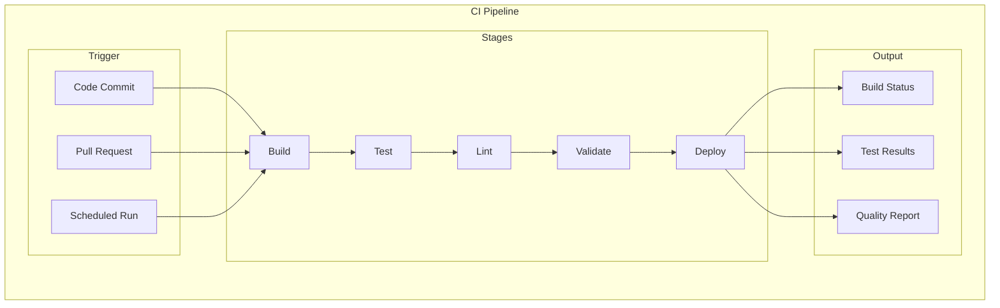
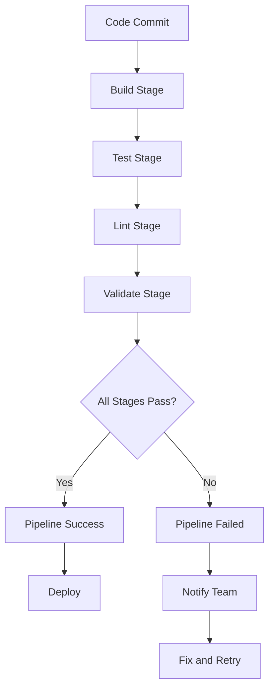
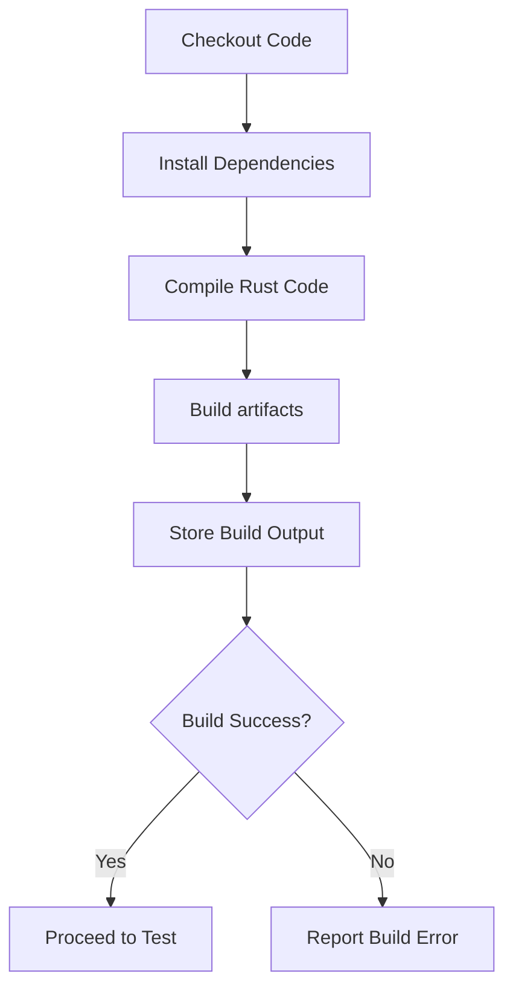
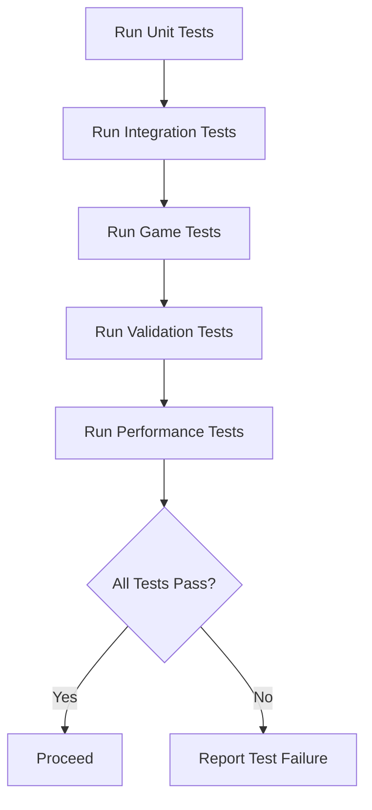
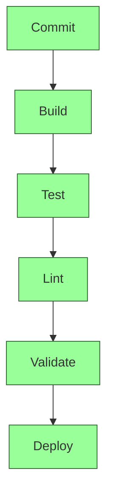
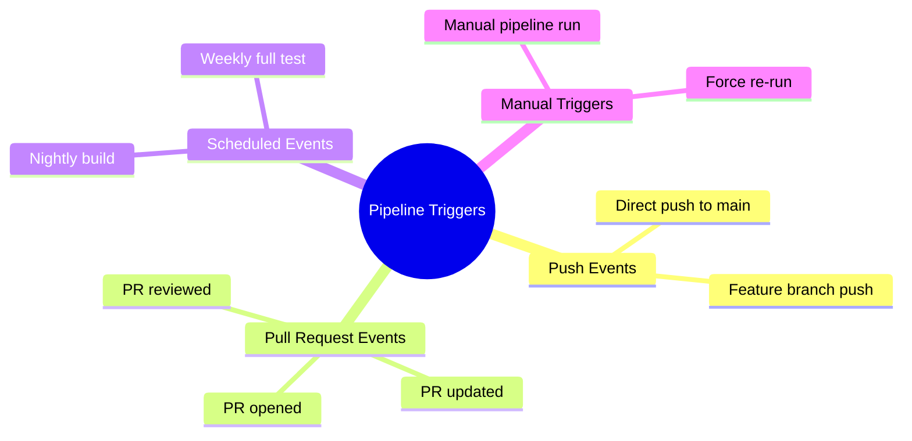

# Plan 01 — CI Pipeline: the repository status is explicit and evidence based

> **Status: PARTIAL (2026-09-27).** A GitHub Actions workflow passed on the pushed revision; coverage, research validation, and deployment jobs remain outside this workflow.

**Goal:** State the current implementation and evidence boundary for ci pipeline.
**Builds on:** [00](../../00-scope-and-traceability.md) — the project is supervised 4×4 2048 policy learning, and framework evaluation is a separate research track.

---

## Decision and evidence

**A minimal CI workflow is configured** for pushes to `main`, pull requests, and manual dispatch. It initializes submodules and runs formatting, root tests, and Clippy through `scripts/ci-check.sh`. The script passes locally, and the first hosted Actions run passed on successive pushed revisions, including commit `af022d0` (run [36280654071](https://github.com/Evintkoo/2048-ml/actions/runs/36280654071)). Research validation and deployment remain separate or out of scope.

## 1. Purpose

Define the continuous integration pipeline for the 2048 ML system.

## 2. CI Pipeline Architecture


```mermaid
flowchart TD
    subgraph "CI Pipeline"
        subgraph "Trigger"
            CS[Code Commit]
            PR[Pull Request]
            SC[Scheduled Run]
        end
        
        subgraph "Stages"
            S1[Build]
            S2[Test]
            S3[Lint]
            S4[Validate]
            S5[Deploy]
        end
        
        subgraph "Output"
            R[Build Status]
            T[Test Results]
            QR[Quality Report]
        end
        
        CS --> S1
        PR --> S1
        SC --> S1
        S1 --> S2
        S2 --> S3
        S3 --> S4
        S4 --> S5
        S5 --> R
        S5 --> T
        S5 --> QR
    end
```

## 3. Pipeline Stages


```mermaid
flowchart TD
    A[Code Commit] --> B[Build Stage]
    B --> C[Test Stage]
    C --> D[Lint Stage]
    D --> E[Validate Stage]
    E --> F{All Stages Pass?}
    F -->|Yes| G[Pipeline Success]
    F -->|No| H[Pipeline Failed]
    G --> I[Deploy]
    H --> J[Notify Team]
    J --> K[Fix and Retry]
```

## 4. Stage Details

| Stage | Command | Duration | Failure Action |
|-------|---------|----------|----------------|
| Build / check | `cargo test` (builds the root package) | Hosted duration not measured | Job fails on nonzero exit |
| Tests | `cargo test` | Hosted duration not measured | Job fails on nonzero exit |
| Lint / format | `cargo fmt --check`; `cargo clippy --all-targets -- -D warnings` | Hosted duration not measured | Job fails on nonzero exit |
| Research validation | Dataset and benchmark protocols | Not automated | Pending separate evidence |
| Deploy | No deployment target in current scope | N/A | Out of scope |

## 5. Build Stage


```mermaid
flowchart TD
    A[Checkout Code] --> B[Install Dependencies]
    B --> C[Compile Rust Code]
    C --> D[Build artifacts]
    D --> E[Store Build Output]
    E --> F{Build Success?}
    F -->|Yes| G[Proceed to Test]
    F -->|No| H[Report Build Error]
```

## 6. Test Stage


```mermaid
flowchart TD
    A[Run Unit Tests] --> B[Run Integration Tests]
    B --> C[Run Game Tests]
    C --> D[Run Validation Tests]
    D --> E[Run Performance Tests]
    E --> F{All Tests Pass?}
    F -->|Yes| G[Proceed]
    F -->|No| H[Report Test Failure]
```

## 7. Pipeline Visualization


```mermaid
graph TD
    A[Commit] --> B[Build]
    B --> C[Test]
    C --> D[Lint]
    D --> E[Validate]
    E --> F[Deploy]
    
    style A fill:#9f9,stroke:#363
    style F fill:#9f9,stroke:#363
    style B fill:#9f9,stroke:#363
    style C fill:#9f9,stroke:#363
    style D fill:#9f9,stroke:#363
    style E fill:#9f9,stroke:#363
```

## 8. Pipeline Triggers


```mermaid
mindmap
  root((Pipeline Triggers))
    Push Events
      Direct push to main
      Feature branch push
    Pull Request Events
      PR opened
      PR updated
      PR reviewed
    Scheduled Events
      Nightly build
      Weekly full test
    Manual Triggers
      Manual pipeline run
      Force re-run
```

## 9. Pipeline Configuration

```rust
pub struct CIPipelineConfig {
    pub stages: Vec<Stage>,
    pub timeout_seconds: u64,
    pub retry_count: usize,
    pub notifications: Vec<Notification>,
    pub branches: Vec<String>,
    pub triggers: Vec<Trigger>,
}
```

## 10. Pipeline Reporting

Each pipeline run produces:
- Build status dashboard
- Test coverage report
- Performance metrics
- Code quality scores
- Deployment status

## Current Repository Status

`.github/workflows/ci.yml` runs `scripts/ci-check.sh` on GitHub-hosted Ubuntu with stable Rust. The script passed locally and in hosted run [36280654071](https://github.com/Evintkoo/2048-ml/actions/runs/36280654071) on commit `af022d0`: format check, 38/38 root tests, and Clippy. Coverage reporting, scheduled research/performance jobs, and deployment are not configured; deployment is outside current scope. The older stage and trigger diagrams above are target descriptions where they include validation, scheduling, notifications, or deployment; the workflow configuration is authoritative for current behavior.

---

## Verification (definition of done)

1. `test -f plans/09-Quality/03-CI/01-ci-pipeline.md` exits 0.
2. `grep -q '^# Plan 01 — ' plans/09-Quality/03-CI/01-ci-pipeline.md` exits 0.
3. `grep -q '^> \\*\\*Status:' plans/09-Quality/03-CI/01-ci-pipeline.md` exits 0.
4. `grep -q '^\*\*Goal:' plans/09-Quality/03-CI/01-ci-pipeline.md` exits 0.
5. `grep -q '^## Decision and evidence$' plans/09-Quality/03-CI/01-ci-pipeline.md` exits 0.
6. `grep -q '^## Open questions$' plans/09-Quality/03-CI/01-ci-pipeline.md` exits 0.
7. `grep -q '^## Later$' plans/09-Quality/03-CI/01-ci-pipeline.md` exits 0.
8. `bash /Users/evintleovonzko/Documents/works/kolosal/planout2/v2-ai-express/.claude/skills/writing-planout-plans/check-plan.sh plans/09-Quality/03-CI/01-ci-pipeline.md` exits 0.

## Open questions

- **Broader CI coverage remains out of scope.** The workflow does not run research benchmarks, coverage measurement, or deployment; add those only with separately defined requirements.

## Later

- **Complete the remaining research or implementation work recorded above.** It stays deferred until its prerequisites, compute budget, and measurable acceptance evidence are available.
