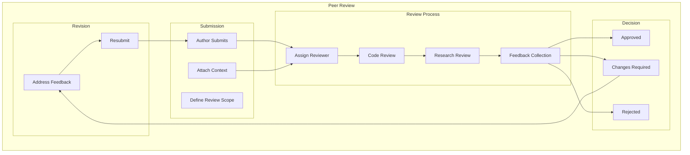
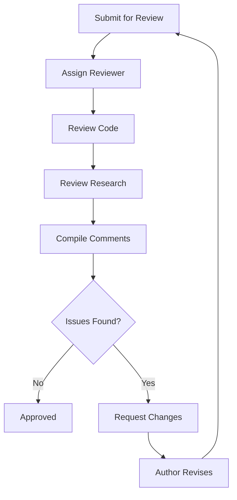
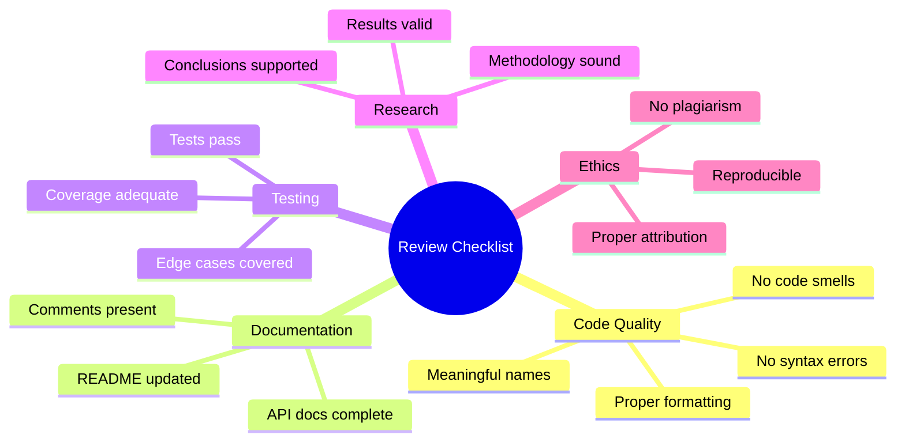
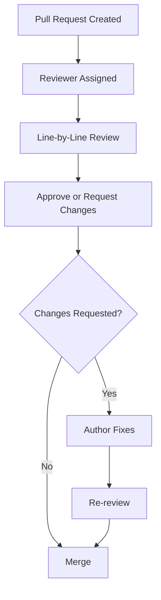
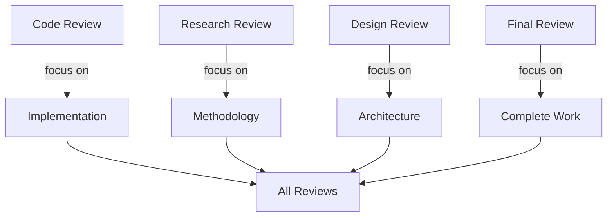

# Plan 01 — Peer Review: the repository status is explicit and evidence based

> **Status: PLANNED.** Not yet restarted in strict sequence.

**Goal:** State the current implementation and evidence boundary for peer review.
**Builds on:** [00](../../00-scope-and-traceability.md) — the project is supervised 4×4 2048 policy learning, and framework evaluation is a separate research track.

---

## Decision and evidence

**This plan treats its subject as partial or pending work, not as a research finding.** The rejected alternative is to infer completion from a plan title or related code alone. The ledger records this disposition: Not yet restarted in strict sequence.

## 1. Purpose

Define peer review procedures for the 2048 ML system code and research.

## 2. Peer Review Framework



## 3. Review Criteria

| Criterion | Description | Weight |
|-----------|-------------|--------|
| Correctness | Code works as intended | 30% |
| Readability | Code is clear and documented | 20% |
| Performance | Efficient execution | 20% |
| Design | Good architectural choices | 15% |
| Testing | Adequate test coverage | 15% |

## 4. Review Process



## 5. Review Checklist



## 6. Review Workflow



## 7. Review Metrics

```rust
pub struct PeerReviewResult {
    pub reviewer_name: String,
    pub review_date: DateTime<Utc>,
    pub approval_status: ApprovalStatus,
    pub issues_found: usize,
    pub issues_resolved: usize,
    pub overall_score: f64,
    pub comments: Vec<String>,
    pub recommendations: Vec<String>,
}
```

## 8. Review Types



## 9. Review Timeline

```mermaid
gantt
    title Peer Review Timeline (relative days — replace YYYY-MM-DD with actual dates at run time)
    dateFormat  YYYY-MM-DD
    section Review 1
    Submission      :a1, TBD, 1d
    Review          :after a1, 2d
    Feedback        :after a1, 3d
    Revision        :after a1, 4d
    Re-review       :after a1, 6d
    Approval        :after a1, 7d
```

## 10. Review Approval Criteria

- All critical issues resolved
- All major issues addressed
- Test coverage ≥ 80%
- Documentation complete
- Research methodology validated
- Results reproducible

## Implementation Record

- Review guidance is documented, but no peer/code/experiment review has been requested or recorded. Example approval thresholds and timeline are templates, not completed review evidence.

---

## Verification (definition of done)

1. `test -f plans/09-Quality/04-Review/01-peer-review.md` exits 0.
2. `grep -q '^# Plan 01 — ' plans/09-Quality/04-Review/01-peer-review.md` exits 0.
3. `grep -q '^> \\*\\*Status:' plans/09-Quality/04-Review/01-peer-review.md` exits 0.
4. `grep -q '^\*\*Goal:' plans/09-Quality/04-Review/01-peer-review.md` exits 0.
5. `grep -q '^## Decision and evidence$' plans/09-Quality/04-Review/01-peer-review.md` exits 0.
6. `grep -q '^## Open questions$' plans/09-Quality/04-Review/01-peer-review.md` exits 0.
7. `grep -q '^## Later$' plans/09-Quality/04-Review/01-peer-review.md` exits 0.
8. `bash /Users/evintleovonzko/Documents/works/kolosal/planout2/v2-ai-express/.claude/skills/writing-planout-plans/check-plan.sh plans/09-Quality/04-Review/01-peer-review.md` exits 0.

## Open questions

- **The plan-scale evidence remains bounded by current results.** Not yet restarted in strict sequence. Any larger corpus or external benchmark needs a declared resource budget and retained artifacts.

## Later

- **Complete the remaining research or implementation work recorded above.** It stays deferred until its prerequisites, compute budget, and measurable acceptance evidence are available.
