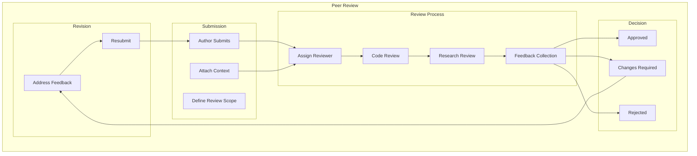
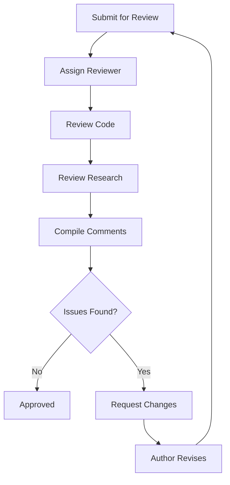
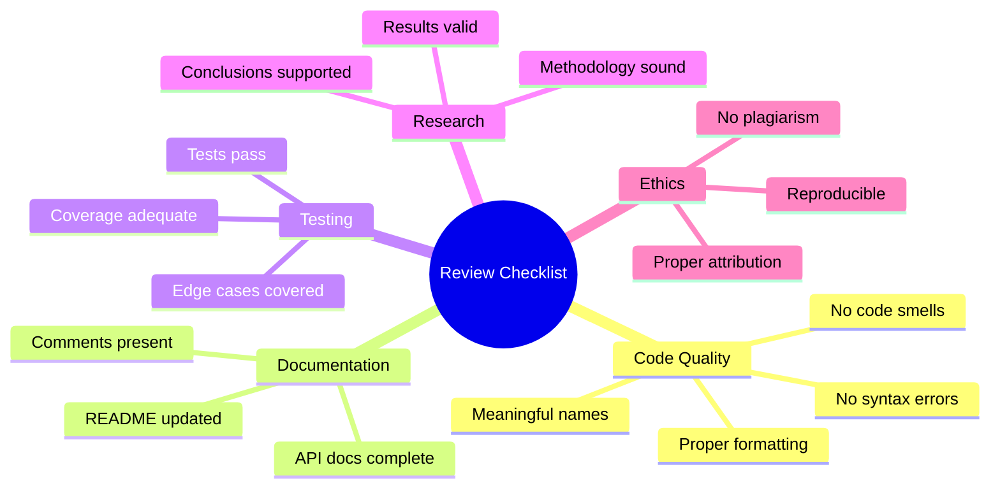
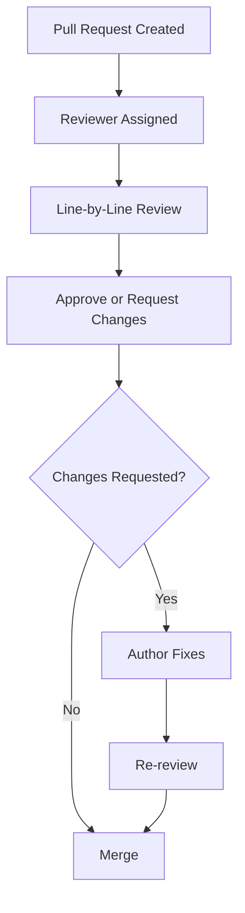
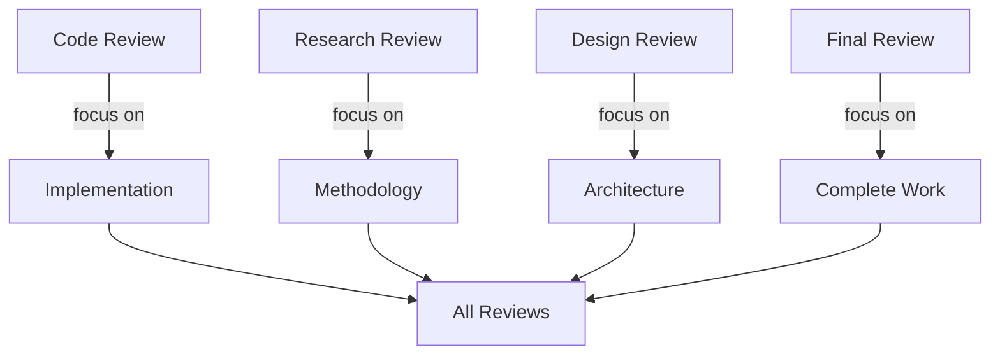
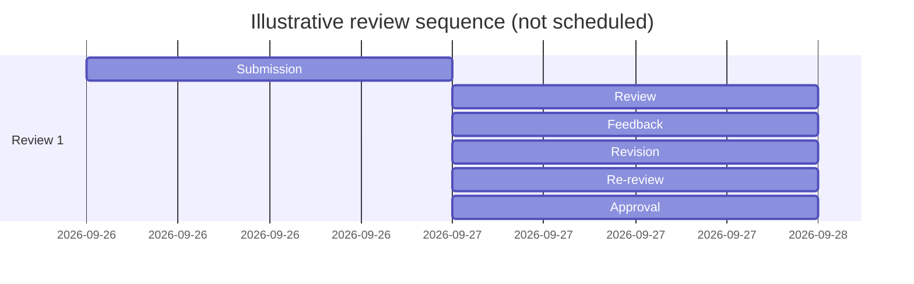

# Plan 01 — Peer Review: the repository status is explicit and evidence based

> **Status: PARTIAL.** Review guidance is present; no independent peer review has been performed or recorded.

**Goal:** State the current implementation and evidence boundary for peer review.
**Builds on:** [00](../../00-scope-and-traceability.md) — the project is supervised 4×4 2048 policy learning, and framework evaluation is a separate research track.

---

## Decision and evidence

**Peer review is a recorded independent assessment, not a status inferred from internal checks.** No reviewer assignment or decision is present in the repository, so this ticket documents a procedure and remains partial.

## 1. Reviewers assess evidence and limits, not completion labels

Define peer review procedures for the 2048 ML system code and research.

## 2. A review records scope, findings and resolution

## 3. Review criteria follow the claim being assessed

| Criterion | Review question |
|-----------|-----------------|
| Correctness | Are behavior and claims supported by code or retained evidence? |
| Readability | Can another researcher follow the implementation and protocol? |
| Performance | Are performance claims backed by reproducible measurements? |
| Design | Does the design respect the canonical scope and data boundaries? |
| Testing | Is validation evidence stated with its limits? |

## 4. Review proceeds from a defined change set to a recorded decision

## 5. The checklist covers implementation and research evidence

## 6. Revisions return to the same reviewer scope

## 7. A durable record carries the review outcome

When a review is performed, record the reviewer, date, scope, findings, requested changes, resolution, and decision in a durable repository artifact. No result structure or scoring API is implemented by this project.

## 8. Code, method and design are separate review scopes

## 9. Dates are set when a reviewer accepts the request

## 10. Approval requires resolved material issues and supported claims

- All critical issues resolved
- All major issues addressed
- Validation evidence and its limitations are documented
- Documentation complete
- Research methodology validated
- Results reproducible

## Implementation Record

- Review guidance is documented, but no peer review has been requested or recorded. The example timeline is illustrative; it is not a scheduled review. No coverage percentage or composite approval score is an established project gate.

---

## Verification (definition of done)

1. `test -f plans/09-Quality/04-Review/01-peer-review.md` exits 0.
2. `grep -q '^> \\*\\*Status: PARTIAL' plans/09-Quality/04-Review/01-peer-review.md` exits 0.
3. `grep -q '^\\*\\*Goal:' plans/09-Quality/04-Review/01-peer-review.md` exits 0.
4. `grep -q '^## 3. Review criteria follow the claim being assessed$' plans/09-Quality/04-Review/01-peer-review.md` exits 0.
5. `grep -q 'No reviewer assignment or decision is present' plans/09-Quality/04-Review/01-peer-review.md` exits 0.
6. `! grep -q '80%' plans/09-Quality/04-Review/01-peer-review.md` exits 0.
7. `grep -q '^## Open questions$' plans/09-Quality/04-Review/01-peer-review.md` exits 0.
8. `grep -q '^## Later$' plans/09-Quality/04-Review/01-peer-review.md` exits 0.
9. `bash /Users/evintleovonzko/Documents/works/kolosal/planout2/v2-ai-express/.claude/skills/writing-planout-plans/check-plan.sh plans/09-Quality/04-Review/01-peer-review.md` exits 0.

## Open questions

- No reviewer or review date is assigned. Assigning one requires an available independent reviewer and a defined change set; until then, no approval claim can be made.

## Later

- **Independent review remains deferred.** It requires a reviewer who did not author the reviewed change and a scope with retained evidence.
